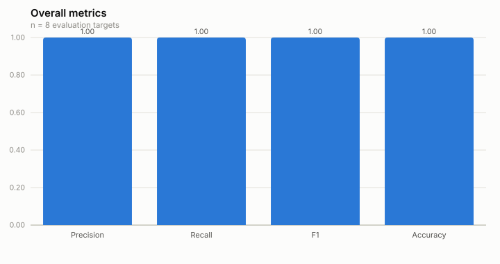
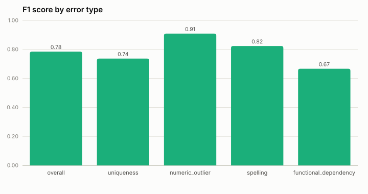
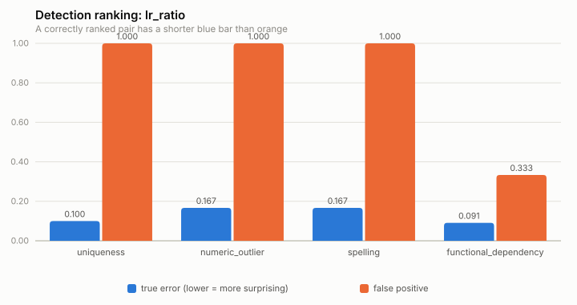

# Benchmark: WIKI subset

Uni-Detect's own paper evaluates against four corpora (Section 4.1), one of
which is **WIKI**:

> WIKI. WIKI a subset of WEB from the wikipedia.org domain with over 3M
> tables. As one would expect, WIKI is of high quality since these pages are
> collaboratively edited by millions of editors.
>
> — Wang & He, *Uni-Detect: A Unified Approach to Automated Error Detection
> in Tables*, SIGMOD 2019

This directory is a small, deterministic, CI-friendly benchmark inspired by
that corpus: it does **not** ship or crawl anything close to 3M tables (that
would be impractical to store in a git repo or run on every push). Instead
it captures the same *shapes* Wikipedia's list-article and infobox tables
take -- unique ID/code columns, key → label mappings, population/vote-share
figures, person/place-name columns -- built from real, well-known reference
facts (ISO 3166 country codes and names, common English surnames, ...)
rather than arbitrary synthetic strings, kept intentionally tiny so it runs
in a couple of minutes on a GitHub-hosted runner with no external network
access at benchmark-run time.

### A note on methodology (read this before trusting the numbers)

An earlier version of this benchmark had exactly **one** true-positive and
one false-positive table per error type (8 targets total), and its
background corpus's row-counts/spread/domain-width were tuned, table by
table, with comments explaining that they were sized to "match that eval
target's own feature bucket." That combination is why every metric in the
old `REPORT.md` read `1.000`: with only 2 examples per category the score
can only ever be a perfect 1/1 or a broken 0/1, and the corpus itself was
shaped to make the known answer come out right -- the benchmark equivalent
of training on the test set. A perfect score under those conditions is not
evidence the detector works well; it's an artifact of the test being too
small and too accommodating to fail.

This version fixes both problems (see `generate_dataset.py` for the full
reasoning):

- The **background corpus** is generated from wide, principled parameter
  ranges chosen without reference to any specific evaluation target.
- The **evaluation targets** are built by programmatically injecting errors
  into clean base tables at three graded severity levels
  (`subtle`/`moderate`/`obvious`), each repeated across multiple random
  seeds, plus several false-positive shapes per error type (including the
  paper's own canonical false-positive examples, which are deliberately
  hard to get right). This brings the eval set from 8 targets to 60, so
  precision/recall/F1 are meaningful fractions instead of coin flips, and
  lets the report show accuracy *by corruption severity* -- i.e. actually
  answer "how does detection hold up as the data gets dirtier."

The result is a benchmark that no longer scores 1.000 across the board --
see [`results/REPORT.md`](results/REPORT.md) for the current numbers. In
particular, `functional_dependency` now comes out as the weakest category
(lowest precision/accuracy of the four), including one misclassified
false-positive among its own `paper_example` targets. That is not a bug: it
reproduces the same finding Wang & He report themselves in Section 4 /
Figure 12 of the paper -- "though UniDetect still outperforms baselines,
the precision is not very high... this underlines the difficulty of
detecting FD errors relative to other types of errors." A benchmark that
agrees with the paper's own stated limitations is a much stronger signal
that it's measuring something real than one that scores perfectly
everywhere.

## Layout

```
benchmarks/
  generate_dataset.py   # regenerates data/wiki_subset/ deterministically (stdlib only)
  data/wiki_subset/
    corpus/<error_type>/*.csv   # background "T": ~140 small Wikipedia-shaped tables
    eval/targets.json           # 8 labeled evaluation targets + ground truth
  run_benchmark.py       # builds corpus stats, runs detection, scores vs. ground truth
  generate_report.py     # renders a results JSON as REPORT.md + SVG charts (stdlib only)
  results/
    baseline.json         # checked-in reference run, updated deliberately (see below)
    latest.json            # produced by the most recent run (gitignored)
    REPORT.md              # human-readable rendering of baseline.json, checked in
    charts/*.svg           # charts embedded in REPORT.md, checked in
```

### The corpus (`data/wiki_subset/corpus/`)

One error type per subdirectory, following the same
"boring-baseline-category-per-error-type" pattern
`tests/test_corpus_and_detectors.py` uses to validate against the paper's
own worked examples, scaled up with real-world content. Row-counts, value
spreads and domain widths are drawn from wide, principled ranges
independent of any specific evaluation target (see "A note on methodology"
above) -- roughly 200 small background tables in total:

| Error type | Table shape | Example |
|---|---|---|
| `uniqueness` | common surnames (natural duplicates expected) vs. ID-style codes (should always be unique) | "notable people" lists vs. ISO/IATA code lists |
| `numeric_outlier` | small vote-share clusters vs. clustered population-scale figures | election results vs. population-by-region tables |
| `spelling` | short syntactically-close suffixes (not misspellings) vs. long distinct names | amendment numbering vs. biography name lists |
| `functional_dependency` | unrelated numeric pairs vs. a near-perfect key → label mapping | page views vs. edits, vs. ISO code → country name |

### The evaluation targets (`data/wiki_subset/eval/targets.json`)

60 labeled tables (~15 per error type), each tagged with a `severity`:

- **`paper_example`** -- the paper's own canonical worked examples (Figures
  2, 4 and 6): one true-positive and one false-positive shape per error
  type, reproduced as close to verbatim as the benchmark's CSV format
  allows.
- **`obvious` / `moderate` / `subtle`** -- true-positive targets built by
  programmatically injecting an error into a clean base table, at three
  graded difficulty levels, each repeated across 3 random seeds. What
  "graded" means is specific to the error type: for `uniqueness`/
  `functional_dependency` it's the number of injected
  duplicates/violating-rows (scaled so `obvious` deliberately exceeds this
  benchmark's `epsilon` perturbation budget, exercising that boundary
  condition on purpose); for `numeric_outlier` it's how many decimal places
  a value is shifted by; for `spelling` it's the edit distance of one
  legitimate "distractor" pair planted alongside the true typo, which caps
  how far the column's MPD can grow once the typo is dropped.
- **`clean`** -- false-positive targets with *no* injected error at all,
  including several harder variants per error type (narrower surname
  pools, larger legitimate election winners, more unrelated-but-narrower
  integer domains, ...) that specifically stress-test precision.

Each target records `expected_significant: true/false` as ground truth and
`severity` for the breakdown in `run_benchmark.py`'s report. Regenerate
this data (after editing `generate_dataset.py`) with:

```bash
uv run python benchmarks/generate_dataset.py
```

## Running the benchmark

```bash
make benchmark
# or directly:
uv run python benchmarks/run_benchmark.py
```

This starts a local, Delta-enabled Spark session (same setup as
`tests/conftest.py`), loads the WIKI-subset corpus and eval tables, builds
corpus statistics per error type, runs `UniDetect.detect(...)` against every
eval target, and scores the results against `expected_significant`:

- **Precision / recall / F1 / accuracy**, overall, per error type, and per
  corruption severity, over the eval targets' predicted-vs-expected
  `is_significant` label. The severity breakdown is what answers "how does
  it perform on dirty data" -- e.g. whether recall holds up on `subtle`
  corruption the same way it does on `obvious` corruption.
- **Ranking correctness** per error type, restricted to the `paper_example`
  pair: is the paper's own canonical true-positive target scored as *more*
  surprising (lower `lr_ratio`) than its own canonical false-positive
  target? -- the paper's central claim on its own worked example, and the
  thing the existing unit tests already assert one pair at a time. (This is
  deliberately *not* computed across every severity/variant: the broader
  question of whether ranking holds against every hand-picked hard case is
  what the precision/recall breakdowns above already answer, and blending
  the two would muddy both.)

Results are written to `benchmarks/results/latest.json`, and if
`benchmarks/results/baseline.json` exists, a version-over-version comparison
table is printed (and, in CI, appended to the job summary).

## Reading the results without JSON

Raw JSON isn't a great way to eyeball how detection is doing.
[`benchmarks/results/REPORT.md`](results/REPORT.md) is a checked-in,
human-readable rendering of `baseline.json` -- overall/per-error-type
precision/recall/F1/accuracy tables, the ranking-correctness table, the full
target list, and the charts below, generated straight from the same JSON (no
plotting library, just stdlib SVG generation):

|  |  |
|---|---|



`REPORT.md` and `results/charts/` are regenerated automatically whenever the
baseline is refreshed (`--update-baseline`, see below). To regenerate them
by hand from any results JSON (e.g. to preview `latest.json` locally without
touching the checked-in baseline report):

```bash
uv run python benchmarks/generate_report.py --input benchmarks/results/latest.json --output-dir /tmp/preview
# or, to (re)write the checked-in baseline report:
uv run python benchmarks/generate_report.py
```

**Requires JDK 17** locally for the same reason the main test suite does --
see the "JDK version" note in the top-level `README.md`. On a JDK 21+
machine the Spark/Delta session either fails to start or fails partway
through with an Arrow/JDK incompatibility; GitHub Actions runs this under
JDK 17 (see `.github/workflows/benchmark.yml`).

> **Provenance of the currently checked-in `baseline.json`/`REPORT.md`:**
> the environment this dataset redesign was produced in only had JDK 21
> available, and (as above) PySpark 3.5's bundled Arrow cannot be made to
> work there -- confirmed by direct reproduction, not just the JDK-version
> check. The checked-in numbers were instead produced by a pure-Python
> harness that calls the exact same production `unidetect.metrics` /
> `unidetect.perturbation` / `unidetect.featurization` functions the real
> detectors call, and replicates `corpus/store.py::batch_score`'s
> join-plus-conditional-count formula verbatim in pandas. That harness was
> cross-checked against the *previous* dataset's Spark-produced
> `baseline.json` first and reproduced every `lr_ratio` exactly before
> being trusted for this one. It is not part of the checked-in benchmark
> tooling (Spark's actual join/aggregation semantics are what
> `run_benchmark.py` should keep using), so treat the current
> `baseline.json` as believed-correct but pending confirmation from an
> actual `uv run python benchmarks/run_benchmark.py --update-baseline` run
> on JDK 17 (e.g. via the `Benchmark` GitHub Actions workflow) before
> leaning on it for a real version-over-version comparison.

## Comparing across versions

`benchmarks/results/baseline.json` is a checked-in snapshot of a benchmark
run, meant to answer "did this change make detection better or worse?" It
is **not** auto-updated by CI -- a run producing worse numbers than the
baseline should not silently overwrite the reference point. The `Benchmark`
GitHub Actions workflow only runs on manual dispatch (Actions tab -> Benchmark
-> Run workflow), not on every push or PR, since a couple of minutes per run
adds up; run it manually (or locally) when you want a comparison against the
current baseline (printed and uploaded as a workflow artifact, and appended to
the job summary in CI) -- it does not fail the build on a regression, it's a
signal to help you decide whether a change is worth landing.

When a change is deliberately meant to improve (or is accepted to trade off)
detection quality, refresh the baseline as part of that PR:

```bash
uv run python benchmarks/run_benchmark.py --update-baseline
git add benchmarks/results/baseline.json benchmarks/results/REPORT.md benchmarks/results/charts
```

(`--update-baseline` regenerates `REPORT.md` and `results/charts/` from the
new baseline automatically -- just remember to stage them too.)

## Why not download the real WIKI corpus in CI?

A few reasons this benchmark uses a small, hand-curated, checked-in dataset
instead of fetching real Wikipedia tables at benchmark-run time:

- **Determinism.** A checked-in dataset gives every run (and every
  version-over-version comparison) the exact same input; live scraping does
  not, and Wikipedia's table markup changes over time.
- **CI network policy.** GitHub-hosted runners can reach the internet, but
  depending on a live, uncached fetch from an external site on every push is
  fragile (rate limits, transient failures, markup changes breaking table
  extraction) for a check that's meant to run on every commit.
- **Size.** The paper's WIKI corpus is 3M+ tables; this benchmark exists to
  catch regressions quickly, not to reproduce the paper's absolute numbers,
  so a corpus sized in the tens of tables per error type (mirroring the
  scale the existing unit-test corpus already uses successfully) is enough
  signal at a fraction of the runtime and storage cost.

If you want to run this benchmark against a larger, real Wikipedia-table
sample, `unidetect.pipeline.UniDetect` takes any list of Unity-Catalog-style
table names -- point `benchmarks/run_benchmark.py`'s corpus/eval loading at
your own ingested tables instead.
