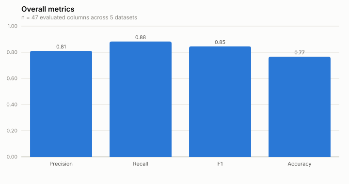
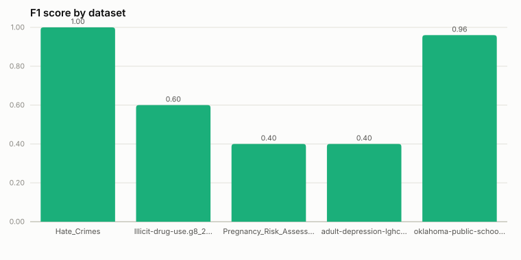

# Benchmark: real_world_gov

`wiki_subset` (see [`../README.md`](../README.md)) is a synthetic benchmark:
a hand-built background corpus plus programmatically-injected errors, sized
and shaped to run in a couple of minutes on CI with no external network
access. This benchmark is the complementary check: real government
open-data tables with real, historically-injected errors and a real,
independently-produced ground truth, from a public error-detection
benchmark corpus rather than anything built for this repository.

## Source

[LUH-DBS/Matelda](https://github.com/LUH-DBS/Matelda), under
[`datasets/DGov_NTR`](https://github.com/LUH-DBS/Matelda/tree/main/datasets/DGov_NTR):
143 real U.S./state/city government open-data tables (census, health,
education, crime, transit, ...), each shipped as a matched
`clean.csv`/`dirty.csv`/`clean_changes.csv` triple -- the same
"raha-style" error-detection benchmark format used across several
data-cleaning papers.

- `clean.csv` -- ground-truth values.
- `dirty.csv` -- the same table with real injected errors (typos,
  transpositions, corrupted codes, ...); same row order and column count as
  `clean.csv`. Its header carries a SQL-type-hint suffix on non-text
  columns (e.g. `"zipcode(long)"`) that `clean.csv`'s header does not --
  `dataset_utils.canonical_column` strips it so both files' columns line
  up.
- `clean_changes.csv` -- ground truth: one row per corrupted *cell*,
  `"<row>.<column>",<dirty_value>,<clean_value>`.

## Which 5 datasets, and why

`select_datasets.py` is the exact, re-runnable selection procedure:

1. List every `DGov_NTR` subdirectory with all three required files (143 of
   them).
2. Keep only those whose `dirty.csv` is at most 300 KB -- a size bound
   applied *before* sampling, for the same reason `wiki_subset`'s own
   corpus is kept small (see `../README.md`'s "Why not download the real
   WIKI corpus in CI?"): this benchmark's data is checked into the repo and
   should stay small enough to review and run on every invocation. 122 of
   the 143 datasets pass this bound; none were excluded for their
   *content*.
3. Sort the 122 survivors by name and draw 5 with
   `random.Random(20240919).sample(...)` -- a fixed seed chosen once and
   not tuned against the outcome.

That produced, in `select_datasets.py`'s selection order:

| Dataset | Rows | Columns | Injected errors |
|---|---|---|---|
| [`Hate_Crimes`](https://github.com/LUH-DBS/Matelda/tree/main/datasets/DGov_NTR/Hate_Crimes) | 42 | 13 | 76 |
| [`Illicit-drug-use.g8_2014_0731_0900`](https://github.com/LUH-DBS/Matelda/tree/main/datasets/DGov_NTR/Illicit-drug-use.g8_2014_0731_0900) | 312 | 7 | 410 |
| [`Pregnancy_Risk_Assessment_Monitoring_System__PRAMS_`](https://github.com/LUH-DBS/Matelda/tree/main/datasets/DGov_NTR/Pregnancy_Risk_Assessment_Monitoring_System__PRAMS_) | 42 | 6 | 12 |
| [`adult-depression-lghc-indicator-24`](https://github.com/LUH-DBS/Matelda/tree/main/datasets/DGov_NTR/adult-depression-lghc-indicator-24) | 161 | 8 | 127 |
| [`oklahoma-public-school-district-directory-january-2016`](https://github.com/LUH-DBS/Matelda/tree/main/datasets/DGov_NTR/oklahoma-public-school-district-directory-january-2016) | 554 | 13 | 876 |

Re-run the selection (e.g. after changing the seed or the size bound)
against a local checkout of the source repo:

```bash
git clone --depth 1 --filter=blob:none --sparse \
    https://github.com/LUH-DBS/matelda /tmp/matelda
git -C /tmp/matelda sparse-checkout set datasets/DGov_NTR
uv run python benchmarks/real_world_gov/select_datasets.py /tmp/matelda --copy
```

## Layout

```
benchmarks/real_world_gov/
  dataset_utils.py       # shared CSV/ground-truth loading (used by run_benchmark.py
                          # and the pure-Python provenance harness -- see below)
  select_datasets.py     # reproduces the dataset selection above; not run in CI
  data/<dataset>/
    clean.csv
    dirty.csv
    clean_changes.csv
  run_benchmark.py        # builds corpus statistics, runs detection, scores vs. ground truth
  generate_report.py      # renders a results JSON as REPORT.md + SVG charts (stdlib only)
  results/
    baseline.json          # checked-in reference run, updated deliberately (see below)
    latest.json             # produced by the most recent run (gitignored)
    REPORT.md               # human-readable rendering of baseline.json, checked in
    charts/*.svg            # charts embedded in REPORT.md, checked in
```

## Methodology: mapping real dirty data onto UniDetect's four error types

UniDetect doesn't take per-cell "is this wrong" labels as input -- it flags
whether a *column* looks statistically surprising relative to a background
corpus, for one of four error types (see `../../ARCHITECTURE.md`). This
benchmark's ground truth (`clean_changes.csv`) is the opposite shape: it
knows exactly which *cells* were corrupted, but nothing about which of the
four error types (if any) a given corruption resembles. Reconciling the two
without overfitting the evaluation to what the detector already does works
like this:

1. **Corpus (`T`) = the 5 datasets' `clean.csv` tables.** `build_corpus_statistics`
   runs against all 5 clean tables together, across all four error types --
   "what do these real government tables typically look like when they're
   right." This is a tiny corpus by the paper's own standard (5 tables, not
   millions), which matters for reading the results below.
2. **Eval targets (`D`) = the 5 datasets' `dirty.csv` tables**, i.e. the
   real corrupted data, run through `detect(...)` for every error type at
   once (uniqueness and FD naturally only fire on columns/pairs that fit
   their own shape -- there's no manual filtering by column type).
3. **Per-column prediction.** `detect()` returns one row per candidate
   (a single column for uniqueness/outlier/spelling, a column *pair* for
   FD). For each `(dataset, column)`, this benchmark keeps the
   *best* (lowest `lr_ratio`) candidate that touched that column across
   every error type and every candidate -- a column is "predicted
   significant" if *any* detector flagged it, which is the honest reading
   given ground truth has no error-type label to check a specific detector
   against.
4. **Per-column ground truth.** `expected_significant = True` iff
   `clean_changes.csv` records at least one corrupted cell in that column
   (`error_count > 0`).
5. **Scoring** is the same precision/recall/F1/accuracy confusion matrix
   `wiki_subset` uses (`common.metrics.confusion_metrics`), computed over
   all 47 `(dataset, column)` pairs, overall and broken down by dataset.

This means a "true positive" here is coarser than the paper's own
per-value-pair explanations: a column can be flagged for the right general
reason via the wrong specific mechanism, and in practice it usually is --
of the 47 columns' best-matching candidate, 43 came from the
functional-dependency detector (uniqueness, spelling and numeric-outlier
combined only "won" for 4), simply because FD has far more chances to find
a low `lr_ratio` for a given column: with up to 12 other columns per table
to pair it against, one near-key relationship is enough. This is an honest
side effect of scoring at column granularity without a per-error-type
ground truth to check a specific detector against, not an artifact of the
scoring -- see the results discussion below.

Config (`epsilon=0.05`, `alpha=0.2`, `prevalence_edges=(2, 5, 20, 100,
1000)`) matches `wiki_subset`'s own choice of scaled-down bucket edges, for
the same reason: both benchmarks' corpora are tens of tables, not the
paper's web-scale crawl (see `tests/test_corpus_and_detectors.py::config`).

## Reading the results

See [`results/REPORT.md`](results/REPORT.md) for the full per-column
breakdown. The headline numbers (5 datasets, 47 columns total):

|  |  |
|---|---|

Two things stand out, both traceable to specific rows in
[`results/REPORT.md`](results/REPORT.md)'s per-column table rather than
guesswork:

- `Hate_Crimes` and `oklahoma-public-school-district-directory-january-2016`
  score at or near 1.0. Both are wide tables (13 columns) where the
  raha-style error injection spread real errors across *every* column, so
  there were no genuinely clean columns for the FD detector's
  many-pairs-per-column strategy (see above) to false-positive on -- it
  only had true positives available to find, and found nearly all of them.
- `Illicit-drug-use.g8_2014_0731_0900` and `adult-depression-lghc-indicator-24`
  are where FD's per-pair strategy backfires: each has a run of narrow,
  correlated numeric measurement columns (percentages/frequencies/CIs
  derived from the same underlying counts) that are genuinely clean but sit
  in a near-FD relationship with a neighboring column anyway. All 7 false
  positives in this benchmark are exactly this shape, and every one of
  them is a close call, not a degenerate score: `lr_ratio` between `0.11`
  and `0.20` against a significance cutoff (`alpha`) of `0.20` -- a real,
  computed likelihood ratio that happened to land just inside the
  threshold, not a "no corpus support" default. The 4 false negatives are
  the mirror image: real errors whose best candidate scored `0.25`-`0.5`,
  just *outside* the cutoff.

This -- FD's precision being the weak point once background support
exists at all -- is the same finding `../README.md` reports for
`wiki_subset` and the same one Wang & He report for their own paper
(Section 4, on FD: "though UniDetect still outperforms baselines, the
precision is not very high"). Seeing it reproduce on independent, real
data (not tables built to exercise this benchmark's own corner cases) is a
stronger signal that this is a real property of the method than either
benchmark alone would be. A real deployment (see `../../ARCHITECTURE.md`
Sec. 1: "the corpus `T`... the tables already registered in Unity Catalog")
would build this corpus from every governed table in a catalog, not 5 --
whether that changes these borderline calls is exactly what a larger
background corpus would need to be run to find out.

## Running the benchmark

```bash
uv run python benchmarks/real_world_gov/run_benchmark.py
```

Requires **JDK 17** locally, same as `wiki_subset` -- see the "JDK version"
note in the top-level `README.md`. On a JDK 21+ machine the Spark/Delta
session either fails to start or fails partway through with an
Arrow/JDK incompatibility.

> **Provenance of the currently checked-in `baseline.json`/`REPORT.md`:**
> produced in an environment with only JDK 21 available (see above), so --
> following the exact precedent `../README.md` documents for `wiki_subset`'s
> own baseline -- by a pure-Python harness that calls the same production
> `unidetect.perturbation` / `unidetect.featurization` / `unidetect.strategies`
> functions `run_benchmark.py`'s real Spark pipeline calls, and replicates
> `unidetect.corpus.builder.CorpusStatsBuilder` (the offline per-column/per-pair
> statistics) and `unidetect.corpus.store.CorpusStatsStore.batch_score` (the
> join-plus-conditional-count likelihood ratio) in plain Python. Unlike
> `wiki_subset`'s harness, this one has no prior Spark-produced baseline to
> cross-check against (this is a new benchmark) -- treat `baseline.json` as
> believed-correct but pending confirmation from an actual
> `uv run python benchmarks/real_world_gov/run_benchmark.py --update-baseline`
> run on JDK 17 before leaning on it for a version-over-version comparison.
> It is not part of the checked-in benchmark tooling, the same way
> `wiki_subset`'s one-off harness isn't.

## Comparing across versions

Same policy as `wiki_subset` (see `../README.md`): `results/baseline.json`
is a checked-in snapshot, not auto-updated by CI. Refresh it deliberately
when a change is meant to affect detection quality:

```bash
uv run python benchmarks/real_world_gov/run_benchmark.py --update-baseline
git add benchmarks/real_world_gov/results/baseline.json \
        benchmarks/real_world_gov/results/REPORT.md \
        benchmarks/real_world_gov/results/charts
```
