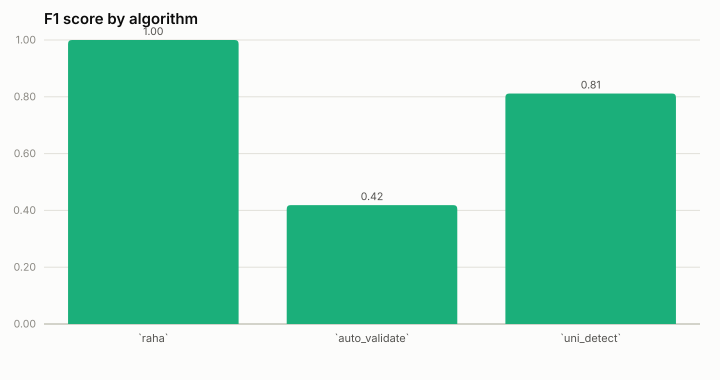
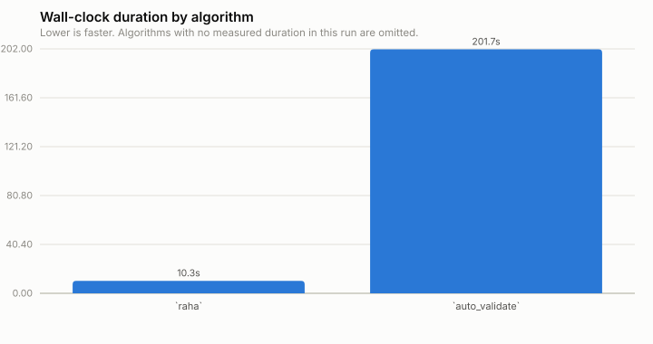

# Benchmark: real_world_gov

`wiki_subset` (see [`../wiki_subset/README.md`](../wiki_subset/README.md)) is a synthetic benchmark:
a hand-built background corpus plus programmatically-injected errors, sized
and shaped to run in a couple of minutes on CI with no external network
access. This benchmark is the complementary check: real government
open-data tables with real, historically-injected errors and a real,
independently-produced ground truth, from a public error-detection
benchmark corpus rather than anything built for this repository.

This benchmark runs **every registered algorithm** (see
[`open_detect.algorithms`](../../ARCHITECTURE.md)) against the same 5 datasets
and reports a head-to-head comparison -- effectiveness (precision/recall/F1/
accuracy) and wall-clock duration -- rather than one algorithm's numbers in
isolation. `uni_detect`, `raha` and `auto_validate` are covered today; a
further algorithm added later picks this up automatically (see "Adding a new
algorithm" in the top-level [`README.md`](../../README.md)) as long as its
`run_benchmark.py` integration follows the same `algorithms: {name: {targets,
metrics, duration_seconds, duration_note}}` results shape documented below.

## Source

[LUH-DBS/Matelda](https://github.com/LUH-DBS/Matelda), under
[`datasets/DGov_NTR`](https://github.com/LUH-DBS/Matelda/tree/main/datasets/DGov_NTR):
143 real U.S./state/city government open-data tables (census, health,
education, crime, transit, ...), each shipped as a matched
`clean.csv`/`dirty.csv`/`clean_changes.csv` triple -- the same
"raha-style" error-detection benchmark format used across several
data-cleaning papers.

- `clean.csv` -- ground-truth values.
- `dirty.csv` -- the same table with real injected errors (typos,
  transpositions, corrupted codes, ...); same row order and column count as
  `clean.csv`. Its header carries a SQL-type-hint suffix on non-text
  columns (e.g. `"zipcode(long)"`) that `clean.csv`'s header does not --
  `dataset_utils.canonical_column` strips it so both files' columns line
  up.
- `clean_changes.csv` -- ground truth: one row per corrupted *cell*,
  `"<row>.<column>",<dirty_value>,<clean_value>`.

## Which 5 datasets, and why

`select_datasets.py` is the exact, re-runnable selection procedure:

1. List every `DGov_NTR` subdirectory with all three required files (143 of
   them).
2. Keep only those whose `dirty.csv` is at most 300 KB -- a size bound
   applied *before* sampling, for the same reason `wiki_subset`'s own
   corpus is kept small (see `../wiki_subset/README.md`'s "Why not download the real
   WIKI corpus in CI?"): this benchmark's data is checked into the repo and
   should stay small enough to review and run on every invocation. 122 of
   the 143 datasets pass this bound; none were excluded for their
   *content*.
3. Sort the 122 survivors by name and draw 5 with
   `random.Random(20240919).sample(...)` -- a fixed seed chosen once and
   not tuned against the outcome.

That produced, in `select_datasets.py`'s selection order:

| Dataset | Rows | Columns | Injected errors |
|---|---|---|---|
| [`Hate_Crimes`](https://github.com/LUH-DBS/Matelda/tree/main/datasets/DGov_NTR/Hate_Crimes) | 42 | 13 | 76 |
| [`Illicit-drug-use.g8_2014_0731_0900`](https://github.com/LUH-DBS/Matelda/tree/main/datasets/DGov_NTR/Illicit-drug-use.g8_2014_0731_0900) | 312 | 7 | 410 |
| [`Pregnancy_Risk_Assessment_Monitoring_System__PRAMS_`](https://github.com/LUH-DBS/Matelda/tree/main/datasets/DGov_NTR/Pregnancy_Risk_Assessment_Monitoring_System__PRAMS_) | 42 | 6 | 12 |
| [`adult-depression-lghc-indicator-24`](https://github.com/LUH-DBS/Matelda/tree/main/datasets/DGov_NTR/adult-depression-lghc-indicator-24) | 161 | 8 | 127 |
| [`oklahoma-public-school-district-directory-january-2016`](https://github.com/LUH-DBS/Matelda/tree/main/datasets/DGov_NTR/oklahoma-public-school-district-directory-january-2016) | 554 | 13 | 876 |

Re-run the selection (e.g. after changing the seed or the size bound)
against a local checkout of the source repo:

```bash
git clone --depth 1 --filter=blob:none --sparse \
    https://github.com/LUH-DBS/matelda /tmp/matelda
git -C /tmp/matelda sparse-checkout set datasets/DGov_NTR
uv run python benchmarks/real_world_gov/select_datasets.py /tmp/matelda --copy
```

## Layout

```
benchmarks/real_world_gov/
  dataset_utils.py       # shared CSV/ground-truth loading (used by run_benchmark.py
                          # and the pure-Python provenance harness -- see below)
  select_datasets.py     # reproduces the dataset selection above; not run in CI
  data/<dataset>/
    clean.csv
    dirty.csv
    clean_changes.csv
  run_benchmark.py        # runs every available algorithm, scores each vs. ground truth
  generate_report.py      # renders a results JSON as REPORT.md + SVG charts (stdlib only)
  results/
    baseline.json          # checked-in reference run, updated deliberately (see below)
    latest.json             # produced by the most recent run (gitignored)
    REPORT.md               # human-readable rendering of baseline.json, checked in
    charts/*.svg            # charts embedded in REPORT.md, checked in
```

`run_benchmark.py` runs `raha` (pure pandas, no external dependency beyond
`scikit-learn`/`scipy`), `auto_validate` (pure pandas -- **no** Spark,
`scikit-learn`, or JDK dependency at all, so it runs even when those are
missing) and `uni_detect` (Spark/Delta, requires JDK 17) independently -- any
of them can be skipped (with a printed message) if its dependencies aren't
installed, or in `uni_detect`'s case if a local Delta-enabled Spark session
can't be started at all, and the benchmark still reports whichever
algorithm(s) did run.

## Methodology: uni_detect -- mapping real dirty data onto its four error types

UniDetect doesn't take per-cell "is this wrong" labels as input -- it flags
whether a *column* looks statistically surprising relative to a background
corpus, for one of four error types (see `../../ARCHITECTURE.md`). This
benchmark's ground truth (`clean_changes.csv`) is the opposite shape: it
knows exactly which *cells* were corrupted, but nothing about which of the
four error types (if any) a given corruption resembles. Reconciling the two
without overfitting the evaluation to what the detector already does works
like this:

1. **Corpus (`T`) = the 5 datasets' `clean.csv` tables.** `build_corpus_statistics`
   runs against all 5 clean tables together, across all four error types --
   "what do these real government tables typically look like when they're
   right." This is a tiny corpus by the paper's own standard (5 tables, not
   millions), which matters for reading the results below.
2. **Eval targets (`D`) = the 5 datasets' `dirty.csv` tables**, i.e. the
   real corrupted data, run through `detect(...)` for every error type at
   once (uniqueness and FD naturally only fire on columns/pairs that fit
   their own shape -- there's no manual filtering by column type).
3. **Per-column prediction.** `detect()` returns one row per candidate
   (a single column for uniqueness/outlier/spelling, a column *pair* for
   FD). For each `(dataset, column)`, this benchmark keeps the
   *best* (lowest `lr_ratio`) candidate that touched that column across
   every error type and every candidate -- a column is "predicted
   significant" if *any* detector flagged it, which is the honest reading
   given ground truth has no error-type label to check a specific detector
   against.
4. **Per-column ground truth.** `expected_significant = True` iff
   `clean_changes.csv` records at least one corrupted cell in that column
   (`error_count > 0`).
5. **Scoring** is the same precision/recall/F1/accuracy confusion matrix
   `wiki_subset` uses (`common.metrics.confusion_metrics`), computed over
   all 47 `(dataset, column)` pairs, overall and broken down by dataset.

This means a "true positive" here is coarser than the paper's own
per-value-pair explanations: a column can be flagged for the right general
reason via the wrong specific mechanism, and in practice it usually is --
of the 47 columns' best-matching candidate, 43 came from the
functional-dependency detector (uniqueness, spelling and numeric-outlier
combined only "won" for 4), simply because FD has far more chances to find
a low `lr_ratio` for a given column: with up to 12 other columns per table
to pair it against, one near-key relationship is enough. This is an honest
side effect of scoring at column granularity without a per-error-type
ground truth to check a specific detector against, not an artifact of the
scoring -- see the results discussion below.

Config (`epsilon=0.05`, `alpha=0.2`, `prevalence_edges=(2, 5, 20, 100,
1000)`) matches `wiki_subset`'s own choice of scaled-down bucket edges, for
the same reason: both benchmarks' corpora are tens of tables, not the
paper's web-scale crawl (see `tests/test_corpus_and_detectors.py::config`).

## Methodology: raha

Raha needs no reconciliation step the way `uni_detect` does above -- this
benchmark's `clean.csv`/`dirty.csv`/`clean_changes.csv` triple is already
exactly the "raha-style" format `../../ARCHITECTURE.md` and the top-level
`README.md` describe (the name is not a coincidence: this is the same
benchmark data format the Raha paper and several other data-cleaning papers
use), so it maps onto Raha's actual input/output shape directly:

1. **Input.** Each dataset's `dirty.csv` is scored on its own (Raha has no
   cross-table corpus phase -- see `../../ARCHITECTURE.md` Sec. 0 on why
   Uni-Detect and Raha's operating models aren't forced into one shape).
2. **Labels.** `GroundTruthLabeler(clean_df)` answers Raha's sampled-tuple
   labeling questions by diffing against the dataset's own `clean.csv` --
   the natural "what would a human with the answer key say" stand-in for a
   real labeler in an unattended CI benchmark, at the paper's own default
   `labeling_budget = 20` (Section 6.1).
3. **Per-cell prediction, at two granularities.** Raha natively predicts
   `is_error` per `(row, column)` cell, so this benchmark reports it two
   ways:
   - **Cell-level** -- precision/recall/F1 over every individual cell
     against `clean_changes.csv` directly, the same granularity the paper's
     own Table 5 reports (Section 6).
   - **Column-level** -- the same reduction `uni_detect`'s own output needs
     (a column is "predicted significant" if *any* of its cells was
     flagged), so the two algorithms can be compared in one table despite
     `uni_detect` only ever producing a column-level (or column-pair-level)
     verdict.
4. **Scoring** uses the same `common.metrics.confusion_metrics` both
   granularities and `uni_detect`'s own scoring use.

The two granularities tell different stories on purpose -- see "Reading the
results" below for why the column-level number alone would be misleading.

## Methodology: auto_validate

Auto-Validate (Song & He, SIGMOD 2021) is the one algorithm here whose
operating model *requires* a background corpus `T` -- it cannot infer a
validation pattern without one, and there is deliberately no
self-as-corpus fallback (that would be training on the test set). This
benchmark mirrors `run_uni_detect`'s corpus choice exactly:

1. **Corpus (`T`) = the 5 datasets' `clean.csv` tables**, one
   `build_index()` call over all of them together, read as strings
   (`dtype=str`) -- 47 columns in total. This is the same background data
   `uni_detect`'s `build_corpus_statistics` gets, in the same
   "all 5 clean tables at once, across all error types" shape, so the two
   algorithms are compared against an identically-scoped background.

   **Note on self-inclusion:** because the index is built over *all five*
   clean tables rather than leave-one-out, a given dataset's own clean table
   **is** part of `T` when its own dirty table is being scored. That is
   deliberate and is exactly what `uni_detect` does here (same five tables,
   same call), so the two stay comparable -- but it means neither algorithm
   gets a "held-out" background for this benchmark, which is a real
   limitation of a 5-table corpus rather than a modeling choice. No *dirty*
   table, and no `clean_changes.csv` ground truth, is ever passed into
   `build_index()`.
2. **Eval targets (`D`) = the 5 datasets' `dirty.csv` tables**, scored with
   `auto_validate.detect(df, table_id=...)` against the shared index.
3. **Two granularities**, the same split as Raha's above: **column-level**
   ("was *any* cell flagged") for the apples-to-apples comparison table, and
   **cell-level** (precision/recall/F1 against `clean_changes.csv` directly)
   as Auto-Validate's native per-cell granularity.
4. **Scoring** uses the same `common.metrics.confusion_metrics` every other
   algorithm and both granularities use here.

### The `m` override

The library's `m` (coverage threshold: how many corpus columns must match a
pattern before it's trusted) defaults to the paper's recommended **100**,
which the paper calibrates against a **7.2M-column** web-scale corpus
(Section 6.2). This benchmark's corpus has **47 columns**. At `m=100`, every
single pattern in the index is by construction infeasible (`Cov_T(p)` can
never reach 100 out of 47 columns), so every column would come back
`no_feasible_pattern` and the algorithm would score a meaningless all-zero.

`m` is therefore set to **2**, derived mechanically from corpus size as
`m = max(1, floor(47 * 0.05))` -- "a pattern needs corroboration from at least
5% of the corpus". This is the same scale-a-knob-to-your-corpus-size
reasoning (and the same derive-don't-tune discipline) that `_build_config`
already applies to `prevalence_edges` for `uni_detect` in this same file. The
value was fixed from the corpus size alone, before looking at any eval
result.

**A note on `tau`.** The paper's default `tau=8` (max token count per value)
causes combinatorial explosion on this benchmark: columns with high-cardinality
text values (addresses, phone numbers) generate millions of patterns at
`tau=8`, making `build_index` take unreasonably long. We override `tau` to
**4**, which filters out long tokenized values (e.g. "77943 Hwy 59 N." → 5
tokens, excluded) while keeping patterns for short categorical columns (names,
codes, dates). This is a benchmark-specific configuration override to make the
algorithm runnable on this corpus, not an algorithm change.

The claim is not theoretical: on the checked-in clean tables, `build_index`
with `tau=8` **does not finish within 5 minutes**, while the same call with
`tau=4` completes in ~3 minutes (the full `tau=4` build + detect pass over all
5 dirty tables takes ~3.3 minutes wall-clock; see the duration note in
`baseline.json`). `tau=4` is not a recall-affecting choice -- it only prunes
values wider than 4 tokens from the pattern index, and the short categorical
columns this benchmark actually has errors in are unaffected.

**No other hyperparameter is overridden.** `r=0.05`,
`variant="fmdv_vh"` are the paper's own recommended values, and `theta=0.1`
is the library default (the paper gives no numeric default) -- all left as
defaults deliberately.

### Expected weakness: read Auto-Validate's numbers honestly

Auto-Validate is a **string-format-pattern** method: it infers a
character-class/token-level pattern per column and flags cells whose value
doesn't match. Real government open-data errors in this corpus are mostly
*plausible-looking* corruptions -- typos inside otherwise-consistent text,
transposed digits inside an otherwise-valid code -- and a typo inside a
mostly-homogeneous text column often still matches the inferred
`<letter>+`-style pattern. Columns with genuinely mixed shapes (free text
next to IDs next to numbers) frequently yield **no feasible pattern at all**;
the report surfaces that as `pattern: null` evidence rather than silently
scoring it as a clean pass, so low recall here is expected and is reported
as-is. Nothing was tuned to compensate.

### Duration methodology

Each algorithm's `duration_seconds` is its own wall-clock time to go from
already-loaded clean/dirty data to final predictions across all 5 datasets:
for `raha`, the full `RahaDetector.detect(...)` call (feature generation,
clustering, sampling, labeling, propagation, classifier training and
prediction) per dataset; for `uni_detect`, `build_corpus_statistics(...)`
(offline) plus `detect(...)` (online) together, since Raha has no equivalent
offline/online split to exclude one side of; for `auto_validate`, the offline
`build_index(...)` over the 5 clean tables plus the online `detect(...)` over
the 5 dirty tables, timed together -- the same offline+online accounting
`uni_detect` uses, and the same one stated in Auto-Validate's `duration_note`
in `baseline.json`. All exclude CSV loading and (for `uni_detect`) the
one-time Spark session startup -- a JVM boot cost that would otherwise swamp
the actual algorithmic comparison and is highly environment-dependent (cold
JAR resolution vs. a warm local cache) rather than a property of either
algorithm.

## Reading the results

See [`results/REPORT.md`](results/REPORT.md) for the full per-column and
per-cell breakdown, and the algorithm-comparison table at the top of it for
the headline precision/recall/F1/accuracy/duration numbers side by side.

|  |  |
|---|---|

**Column-level vs. cell-level, and why `raha` scores a perfect 1.000 at
column-level but not at cell-level.** `raha`'s column-level score in
`results/REPORT.md` is a perfect 1.000 -- every column's any-cell-flagged
verdict matches `error_count > 0` exactly on the currently checked-in
baseline. Read alongside the cell-level table right below it in
`REPORT.md` (overall F1 `0.524`, ranging from `0.260` on
`oklahoma-public-school-district-directory-january-2016` to `0.886` on
`adult-depression-lghc-indicator-24`), this is not a contradiction: getting
the column-level call right only requires flagging *one* of a column's
erroneous cells, and every corrupted column in this benchmark's real,
historically-injected data has a double-digit-percent error rate (see the
per-column `Errors`/`Rows` counts in `REPORT.md`) -- a much easier bar than
classifying every individual cell correctly. Uni-Detect only ever produces a
column-level verdict at all, which is exactly why the comparison table uses
that granularity: it is the only one both algorithms can be judged on
side by side. Raha's own, harder, cell-level number is the more informative
one for judging Raha in isolation, and the more faithful comparison to the
paper's own reported numbers.

Two things stand out on the `uni_detect` side, both traceable to specific rows in
[`results/REPORT.md`](results/REPORT.md)'s per-column table rather than
guesswork:

- `Hate_Crimes` and `oklahoma-public-school-district-directory-january-2016`
  score at or near 1.0. Both are wide tables (13 columns) where the
  raha-style error injection spread real errors across *every* column, so
  there were no genuinely clean columns for the FD detector's
  many-pairs-per-column strategy (see above) to false-positive on -- it
  only had true positives available to find, and found nearly all of them.
- `Illicit-drug-use.g8_2014_0731_0900` and `adult-depression-lghc-indicator-24`
  are where FD's per-pair strategy backfires: each has a run of narrow,
  correlated numeric measurement columns (percentages/frequencies/CIs
  derived from the same underlying counts) that are genuinely clean but sit
  in a near-FD relationship with a neighboring column anyway. All 7 false
  positives in this benchmark are exactly this shape, and every one of
  them is a close call, not a degenerate score: `lr_ratio` between `0.11`
  and `0.20` against a significance cutoff (`alpha`) of `0.20` -- a real,
  computed likelihood ratio that happened to land just inside the
  threshold, not a "no corpus support" default. The 4 false negatives are
  the mirror image: real errors whose best candidate scored `0.25`-`0.5`,
  just *outside* the cutoff.

This -- FD's precision being the weak point once background support
exists at all -- is the same finding `../wiki_subset/README.md` reports for
`wiki_subset` and the same one Wang & He report for their own paper
(Section 4, on FD: "though UniDetect still outperforms baselines, the
precision is not very high"). Seeing it reproduce on independent, real
data (not tables built to exercise this benchmark's own corner cases) is a
stronger signal that this is a real property of the method than either
benchmark alone would be. A real deployment (see `../../ARCHITECTURE.md`
Sec. 1: "the corpus `T`... the tables already registered in Unity Catalog")
would build this corpus from every governed table in a catalog, not 5 --
whether that changes these borderline calls is exactly what a larger
background corpus would need to be run to find out.

## Running the benchmark

```bash
uv run python benchmarks/real_world_gov/run_benchmark.py
```

`raha` has no JDK/Spark dependency and runs anywhere `open-detect[raha]` is
installed. `uni_detect` requires **JDK 17** locally, same as `wiki_subset` --
see the "JDK version" note in the top-level `README.md`. On a JDK 21+
machine the Spark/Delta session either fails to start or fails partway
through with an Arrow/JDK incompatibility; `run_benchmark.py` catches this
and still reports `raha`'s results rather than failing the whole run.

> **Provenance of the currently checked-in `baseline.json`/`REPORT.md`:**
> All three algorithms' figures come from a single genuine
> `uv run python benchmarks/real_world_gov/run_benchmark.py --update-baseline`
> run on **JDK 17** (Temurin 17.0.20.1, the version PySpark 3.5's bundled
> Arrow requires), so `uni_detect`'s `duration_seconds` is a real
> Spark/Delta wall-clock measurement rather than a placeholder. The
> *previous* baseline (git `61f6703`, now unreachable) had been produced in a
> JDK-21-only environment where the Spark/Arrow path cannot run; its
> `uni_detect` figures were approximated by a pure-Python provenance harness
> (recorded in that baseline's `algorithms.uni_detect.generation_method`) and
> its `duration_seconds` was `null`. Refreshing the baseline on JDK 17 replaces
> those figures with real Spark/Delta measurements, so the old ones must not
> be used for version-over-version comparison; this baseline supersedes
> them. `raha` and `auto_validate` have no JDK dependency and were re-run in
> the same pass.

## Comparing across versions

Same policy as `wiki_subset` (see `../wiki_subset/README.md`): `results/baseline.json`
is a checked-in snapshot, not auto-updated by CI. Refresh it deliberately
when a change is meant to affect detection quality:

```bash
uv run python benchmarks/real_world_gov/run_benchmark.py --update-baseline
git add benchmarks/real_world_gov/results/baseline.json \
        benchmarks/real_world_gov/results/REPORT.md \
        benchmarks/real_world_gov/results/charts
```
