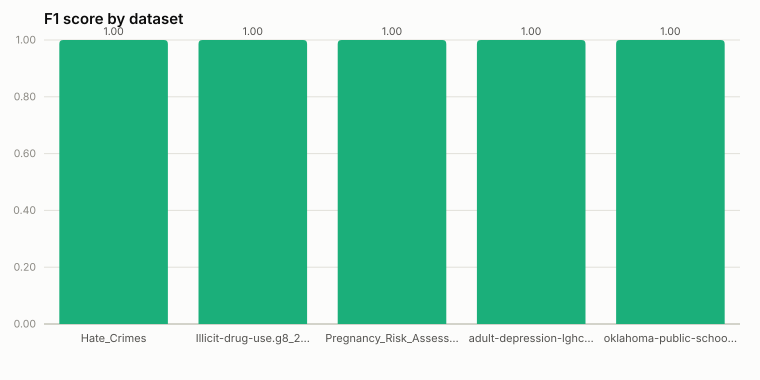

# real_world_gov benchmark results

Human-readable view of the checked-in benchmark run. See [README.md](README.md) for how this benchmark works, where its 5 datasets came from, and how to regenerate this file.

**Generated at:** 2026-09-22T12:06:36.893426+00:00  
**Commit:** `61f6703`  
**Source:** https://github.com/LUH-DBS/Matelda/tree/main/datasets/DGov_NTR

## Algorithm comparison

Every algorithm below scores the same set of (dataset, column) targets against the same `clean_changes.csv` ground truth (see [README.md](README.md) for how each algorithm's per-column verdict is derived), so the comparison is apples-to-apples on effectiveness. Duration is each algorithm's own wall-clock time to go from loaded data to predictions (see README for exactly what is/isn't included, and why one algorithm's duration may be unmeasured in a given run).

| Algorithm | n | Precision | Recall | F1 | Accuracy | Duration (s) |
|---|---|---|---|---|---|---|
| `raha` | 47 | 1.000 | 1.000 | 1.000 | 1.000 | 5.87 |
| `uni_detect` | 47 | 0.811 | 0.882 | 0.845 | 0.766 | n/a[^uni_detect] |

[^uni_detect]: Not measured in this session's environment: only JDK 21 is available, and Uni-Detect's Spark/Arrow path requires JDK 17 (see README). These precision/recall/F1/accuracy figures are reused verbatim from a prior JDK-17 run (git 8c42da0) rather than fabricated; a fresh run on JDK 17 would also fill in a real duration_seconds here.


## `raha`

**Duration:** 5.87s  

| Metric | Value |
|---|---|
| Columns evaluated | 47 |
| Precision | 1.000 |
| Recall | 1.000 |
| F1 | 1.000 |
| Accuracy | 1.000 |



### By dataset (column-level)

Column-level: a column is "predicted significant" if *any* of its cells was flagged -- the same granularity Uni-Detect's own output has, used for the apples-to-apples comparison above. See "Cell-level" below for Raha's native, per-cell granularity (the same one the paper's own Table 5 reports).

| Dataset | n | Precision | Recall | F1 | Accuracy |
|---|---|---|---|---|---|
| **overall** | 47 | 1.000 | 1.000 | 1.000 | 1.000 |
| `Hate_Crimes` | 13 | 1.000 | 1.000 | 1.000 | 1.000 |
| `Illicit-drug-use.g8_2014_0731_0900` | 7 | 1.000 | 1.000 | 1.000 | 1.000 |
| `Pregnancy_Risk_Assessment_Monitoring_System__PRAMS_` | 6 | 1.000 | 1.000 | 1.000 | 1.000 |
| `adult-depression-lghc-indicator-24` | 8 | 1.000 | 1.000 | 1.000 | 1.000 |
| `oklahoma-public-school-district-directory-january-2016` | 13 | 1.000 | 1.000 | 1.000 | 1.000 |

### By dataset (cell-level)

Precision/recall/F1 over every individual `(row, column)` cell against `clean_changes.csv` -- Raha's native evaluation granularity, and typically a more informative number than the column-level reduction above, since a real, historically-corrupted column in this benchmark often has a double-digit-percent error rate: getting the column-level call right only requires flagging *one* of many erroneous cells.

| Dataset | n | Precision | Recall | F1 | Accuracy |
|---|---|---|---|---|---|
| **overall** | 11472 | 0.584 | 0.475 | 0.524 | 0.888 |
| `Hate_Crimes` | 546 | 0.845 | 0.789 | 0.816 | 0.951 |
| `Illicit-drug-use.g8_2014_0731_0900` | 2184 | 0.787 | 0.802 | 0.795 | 0.922 |
| `Pregnancy_Risk_Assessment_Monitoring_System__PRAMS_` | 252 | 0.688 | 0.917 | 0.786 | 0.976 |
| `adult-depression-lghc-indicator-24` | 1288 | 0.829 | 0.953 | 0.886 | 0.976 |
| `oklahoma-public-school-district-directory-january-2016` | 7202 | 0.330 | 0.214 | 0.260 | 0.854 |

### Evaluated columns (column-level)

| Dataset | Column | Rows | Errors | Expected | Predicted | Score | Result |
|---|---|---|---|---|---|---|---|
| `Hate_Crimes` | `casenumber` | 42 | 7 | True | True | 1.000 | ✅ |
| `Hate_Crimes` | `datevalue` | 42 | 3 | True | True | 1.000 | ✅ |
| `Hate_Crimes` | `weekday` | 42 | 10 | True | True | 1.000 | ✅ |
| `Hate_Crimes` | `victims` | 42 | 6 | True | True | 1.000 | ✅ |
| `Hate_Crimes` | `victimrace` | 42 | 5 | True | True | 1.000 | ✅ |
| `Hate_Crimes` | `victimgender` | 42 | 3 | True | True | 1.000 | ✅ |
| `Hate_Crimes` | `victimtype` | 42 | 12 | True | True | 1.000 | ✅ |
| `Hate_Crimes` | `offenders` | 42 | 1 | True | True | 1.000 | ✅ |
| `Hate_Crimes` | `offenderrace` | 42 | 6 | True | True | 1.000 | ✅ |
| `Hate_Crimes` | `offendergender` | 42 | 8 | True | True | 1.000 | ✅ |
| `Hate_Crimes` | `offense` | 42 | 3 | True | True | 1.000 | ✅ |
| `Hate_Crimes` | `locationtype` | 42 | 5 | True | True | 1.000 | ✅ |
| `Hate_Crimes` | `motivation` | 42 | 7 | True | True | 1.000 | ✅ |
| `Illicit-drug-use.g8_2014_0731_0900` | `sexraceethnicity` | 312 | 146 | True | True | 1.000 | ✅ |
| `Illicit-drug-use.g8_2014_0731_0900` | `sex` | 312 | 126 | True | True | 1.000 | ✅ |
| `Illicit-drug-use.g8_2014_0731_0900` | `raceethnicity` | 312 | 95 | True | True | 1.000 | ✅ |
| `Illicit-drug-use.g8_2014_0731_0900` | `yearvalue` | 312 | 0 | False | False | 0.000 | ✅ |
| `Illicit-drug-use.g8_2014_0731_0900` | `percentage` | 312 | 0 | False | False | 0.000 | ✅ |
| `Illicit-drug-use.g8_2014_0731_0900` | `standarderroronpercentage` | 312 | 0 | False | False | 0.000 | ✅ |
| `Illicit-drug-use.g8_2014_0731_0900` | `noteonpercent` | 312 | 43 | True | True | 1.000 | ✅ |
| `Pregnancy_Risk_Assessment_Monitoring_System__PRAMS_` | `yearvalue` | 42 | 0 | False | False | 0.000 | ✅ |
| `Pregnancy_Risk_Assessment_Monitoring_System__PRAMS_` | `sourcevalue` | 42 | 2 | True | True | 1.000 | ✅ |
| `Pregnancy_Risk_Assessment_Monitoring_System__PRAMS_` | `question` | 42 | 1 | True | True | 1.000 | ✅ |
| `Pregnancy_Risk_Assessment_Monitoring_System__PRAMS_` | `prevalence` | 42 | 0 | False | False | 0.000 | ✅ |
| `Pregnancy_Risk_Assessment_Monitoring_System__PRAMS_` | `lowerninefiveconfidenceinterval` | 42 | 9 | True | True | 1.000 | ✅ |
| `Pregnancy_Risk_Assessment_Monitoring_System__PRAMS_` | `upperninefiveconfidenceinterval` | 42 | 0 | False | False | 0.000 | ✅ |
| `adult-depression-lghc-indicator-24` | `yearvalue` | 161 | 0 | False | False | 0.000 | ✅ |
| `adult-depression-lghc-indicator-24` | `strata` | 161 | 0 | False | False | 0.000 | ✅ |
| `adult-depression-lghc-indicator-24` | `strataname` | 161 | 127 | True | True | 1.000 | ✅ |
| `adult-depression-lghc-indicator-24` | `frequency` | 161 | 0 | False | False | 0.000 | ✅ |
| `adult-depression-lghc-indicator-24` | `weightedfrequency` | 161 | 0 | False | False | 0.000 | ✅ |
| `adult-depression-lghc-indicator-24` | `percentvalue` | 161 | 0 | False | False | 0.000 | ✅ |
| `adult-depression-lghc-indicator-24` | `lowerninefivecl` | 161 | 0 | False | False | 0.000 | ✅ |
| `adult-depression-lghc-indicator-24` | `upperninefivecl` | 161 | 0 | False | False | 0.000 | ✅ |
| `oklahoma-public-school-district-directory-january-2016` | `countyname` | 554 | 68 | True | True | 1.000 | ✅ |
| `oklahoma-public-school-district-directory-january-2016` | `code` | 554 | 128 | True | True | 1.000 | ✅ |
| `oklahoma-public-school-district-directory-january-2016` | `districtname` | 554 | 51 | True | True | 1.000 | ✅ |
| `oklahoma-public-school-district-directory-january-2016` | `city` | 554 | 60 | True | True | 1.000 | ✅ |
| `oklahoma-public-school-district-directory-january-2016` | `address` | 554 | 71 | True | True | 1.000 | ✅ |
| `oklahoma-public-school-district-directory-january-2016` | `statevalue` | 554 | 62 | True | True | 1.000 | ✅ |
| `oklahoma-public-school-district-directory-january-2016` | `zip` | 554 | 1 | True | True | 1.000 | ✅ |
| `oklahoma-public-school-district-directory-january-2016` | `phone` | 554 | 122 | True | True | 1.000 | ✅ |
| `oklahoma-public-school-district-directory-january-2016` | `fax` | 554 | 64 | True | True | 1.000 | ✅ |
| `oklahoma-public-school-district-directory-january-2016` | `websiteurl` | 554 | 63 | True | True | 1.000 | ✅ |
| `oklahoma-public-school-district-directory-january-2016` | `superintendent` | 554 | 61 | True | True | 1.000 | ✅ |
| `oklahoma-public-school-district-directory-january-2016` | `superintendentemail` | 554 | 60 | True | True | 1.000 | ✅ |
| `oklahoma-public-school-district-directory-january-2016` | `boardpresident` | 554 | 65 | True | True | 1.000 | ✅ |

## `uni_detect`

**Duration:** not measured -- Not measured in this session's environment: only JDK 21 is available, and Uni-Detect's Spark/Arrow path requires JDK 17 (see README). These precision/recall/F1/accuracy figures are reused verbatim from a prior JDK-17 run (git 8c42da0) rather than fabricated; a fresh run on JDK 17 would also fill in a real duration_seconds here.  

| Metric | Value |
|---|---|
| Columns evaluated | 47 |
| Precision | 0.811 |
| Recall | 0.882 |
| F1 | 0.845 |
| Accuracy | 0.766 |


### By dataset (column-level)

| Dataset | n | Precision | Recall | F1 | Accuracy |
|---|---|---|---|---|---|
| **overall** | 47 | 0.811 | 0.882 | 0.845 | 0.766 |
| `Hate_Crimes` | 13 | 1.000 | 1.000 | 1.000 | 1.000 |
| `Illicit-drug-use.g8_2014_0731_0900` | 7 | 0.500 | 0.750 | 0.600 | 0.429 |
| `Pregnancy_Risk_Assessment_Monitoring_System__PRAMS_` | 6 | 0.500 | 0.333 | 0.400 | 0.500 |
| `adult-depression-lghc-indicator-24` | 8 | 0.250 | 1.000 | 0.400 | 0.625 |
| `oklahoma-public-school-district-directory-january-2016` | 13 | 1.000 | 0.923 | 0.960 | 0.923 |

### Evaluated columns (column-level)

| Dataset | Column | Rows | Errors | Expected | Predicted | lr_ratio | Matched via | Result |
|---|---|---|---|---|---|---|---|---|
| `Hate_Crimes` | `casenumber` | 42 | 7 | True | True | 0.0294 | `functional_dependency` | ✅ |
| `Hate_Crimes` | `datevalue` | 42 | 3 | True | True | 0.0294 | `functional_dependency` | ✅ |
| `Hate_Crimes` | `weekday` | 42 | 10 | True | True | 0.0357 | `functional_dependency` | ✅ |
| `Hate_Crimes` | `victims` | 42 | 6 | True | True | 0.0370 | `functional_dependency` | ✅ |
| `Hate_Crimes` | `victimrace` | 42 | 5 | True | True | 0.0370 | `functional_dependency` | ✅ |
| `Hate_Crimes` | `victimgender` | 42 | 3 | True | True | 0.0370 | `functional_dependency` | ✅ |
| `Hate_Crimes` | `victimtype` | 42 | 12 | True | True | 0.0370 | `functional_dependency` | ✅ |
| `Hate_Crimes` | `offenders` | 42 | 1 | True | True | 0.1250 | `functional_dependency` | ✅ |
| `Hate_Crimes` | `offenderrace` | 42 | 6 | True | True | 0.0370 | `functional_dependency` | ✅ |
| `Hate_Crimes` | `offendergender` | 42 | 8 | True | True | 0.0370 | `functional_dependency` | ✅ |
| `Hate_Crimes` | `offense` | 42 | 3 | True | True | 0.0294 | `functional_dependency` | ✅ |
| `Hate_Crimes` | `locationtype` | 42 | 5 | True | True | 0.0357 | `functional_dependency` | ✅ |
| `Hate_Crimes` | `motivation` | 42 | 7 | True | True | 0.0294 | `functional_dependency` | ✅ |
| `Illicit-drug-use.g8_2014_0731_0900` | `sexraceethnicity` | 312 | 146 | True | True | 0.1429 | `functional_dependency` | ✅ |
| `Illicit-drug-use.g8_2014_0731_0900` | `sex` | 312 | 126 | True | True | 0.1250 | `functional_dependency` | ✅ |
| `Illicit-drug-use.g8_2014_0731_0900` | `raceethnicity` | 312 | 95 | True | True | 0.1111 | `functional_dependency` | ✅ |
| `Illicit-drug-use.g8_2014_0731_0900` | `yearvalue` | 312 | 0 | False | True | 0.1429 | `functional_dependency` | ❌ |
| `Illicit-drug-use.g8_2014_0731_0900` | `percentage` | 312 | 0 | False | True | 0.1250 | `functional_dependency` | ❌ |
| `Illicit-drug-use.g8_2014_0731_0900` | `standarderroronpercentage` | 312 | 0 | False | True | 0.1111 | `functional_dependency` | ❌ |
| `Illicit-drug-use.g8_2014_0731_0900` | `noteonpercent` | 312 | 43 | True | False | 0.5000 | `uniqueness` | ❌ |
| `Pregnancy_Risk_Assessment_Monitoring_System__PRAMS_` | `yearvalue` | 42 | 0 | False | False | 0.5000 | `functional_dependency` | ✅ |
| `Pregnancy_Risk_Assessment_Monitoring_System__PRAMS_` | `sourcevalue` | 42 | 2 | True | False | 0.2500 | `functional_dependency` | ❌ |
| `Pregnancy_Risk_Assessment_Monitoring_System__PRAMS_` | `question` | 42 | 1 | True | False | 0.2500 | `functional_dependency` | ❌ |
| `Pregnancy_Risk_Assessment_Monitoring_System__PRAMS_` | `prevalence` | 42 | 0 | False | True | 0.2000 | `functional_dependency` | ❌ |
| `Pregnancy_Risk_Assessment_Monitoring_System__PRAMS_` | `lowerninefiveconfidenceinterval` | 42 | 9 | True | True | 0.2000 | `functional_dependency` | ✅ |
| `Pregnancy_Risk_Assessment_Monitoring_System__PRAMS_` | `upperninefiveconfidenceinterval` | 42 | 0 | False | False | 0.2500 | `numeric_outlier` | ✅ |
| `adult-depression-lghc-indicator-24` | `yearvalue` | 161 | 0 | False | False | 0.5000 | `numeric_outlier` | ✅ |
| `adult-depression-lghc-indicator-24` | `strata` | 161 | 0 | False | False | 0.3750 | `functional_dependency` | ✅ |
| `adult-depression-lghc-indicator-24` | `strataname` | 161 | 127 | True | True | 0.1429 | `functional_dependency` | ✅ |
| `adult-depression-lghc-indicator-24` | `frequency` | 161 | 0 | False | True | 0.1429 | `functional_dependency` | ❌ |
| `adult-depression-lghc-indicator-24` | `weightedfrequency` | 161 | 0 | False | True | 0.1667 | `functional_dependency` | ❌ |
| `adult-depression-lghc-indicator-24` | `percentvalue` | 161 | 0 | False | True | 0.1818 | `functional_dependency` | ❌ |
| `adult-depression-lghc-indicator-24` | `lowerninefivecl` | 161 | 0 | False | False | 0.2500 | `functional_dependency` | ✅ |
| `adult-depression-lghc-indicator-24` | `upperninefivecl` | 161 | 0 | False | False | 0.2500 | `functional_dependency` | ✅ |
| `oklahoma-public-school-district-directory-january-2016` | `countyname` | 554 | 68 | True | True | 0.1429 | `functional_dependency` | ✅ |
| `oklahoma-public-school-district-directory-january-2016` | `code` | 554 | 128 | True | True | 0.0769 | `functional_dependency` | ✅ |
| `oklahoma-public-school-district-directory-january-2016` | `districtname` | 554 | 51 | True | True | 0.1667 | `functional_dependency` | ✅ |
| `oklahoma-public-school-district-directory-january-2016` | `city` | 554 | 60 | True | True | 0.0769 | `functional_dependency` | ✅ |
| `oklahoma-public-school-district-directory-january-2016` | `address` | 554 | 71 | True | False | 0.2500 | `spelling` | ❌ |
| `oklahoma-public-school-district-directory-january-2016` | `statevalue` | 554 | 62 | True | True | 0.1667 | `functional_dependency` | ✅ |
| `oklahoma-public-school-district-directory-january-2016` | `zip` | 554 | 1 | True | True | 0.0769 | `functional_dependency` | ✅ |
| `oklahoma-public-school-district-directory-january-2016` | `phone` | 554 | 122 | True | True | 0.0769 | `functional_dependency` | ✅ |
| `oklahoma-public-school-district-directory-january-2016` | `fax` | 554 | 64 | True | True | 0.2000 | `functional_dependency` | ✅ |
| `oklahoma-public-school-district-directory-january-2016` | `websiteurl` | 554 | 63 | True | True | 0.1176 | `functional_dependency` | ✅ |
| `oklahoma-public-school-district-directory-january-2016` | `superintendent` | 554 | 61 | True | True | 0.0769 | `functional_dependency` | ✅ |
| `oklahoma-public-school-district-directory-january-2016` | `superintendentemail` | 554 | 60 | True | True | 0.0769 | `functional_dependency` | ✅ |
| `oklahoma-public-school-district-directory-january-2016` | `boardpresident` | 554 | 65 | True | True | 0.0769 | `functional_dependency` | ✅ |

---

_Regenerate this file (and the charts above) from a results JSON with:_

```bash
uv run python benchmarks/real_world_gov/generate_report.py
```

