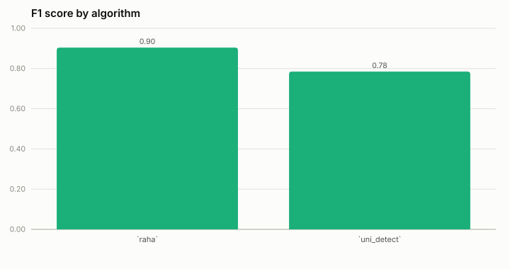
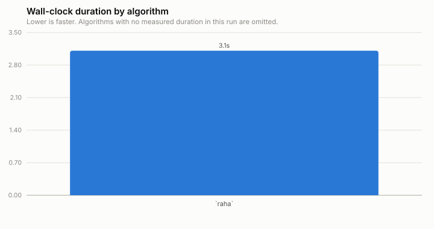
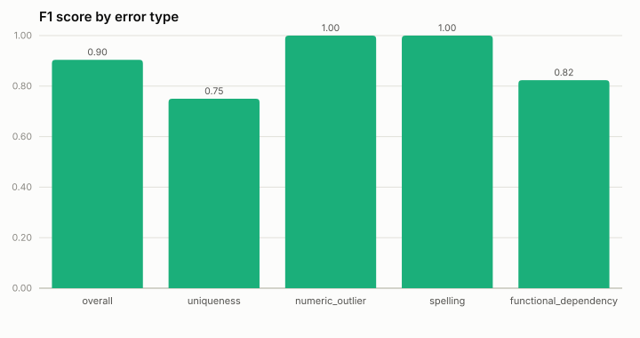
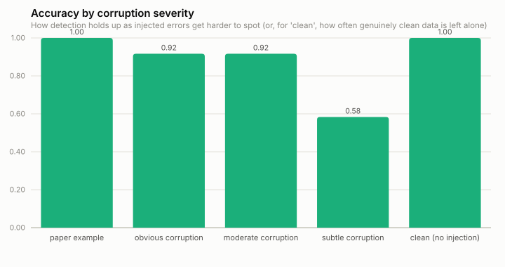
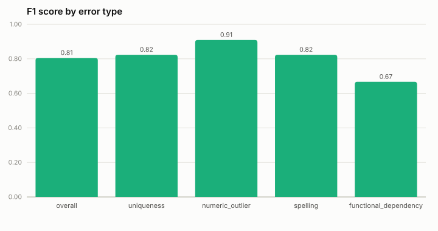
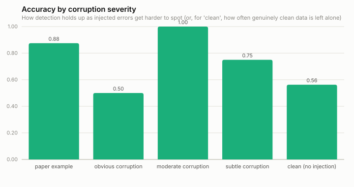
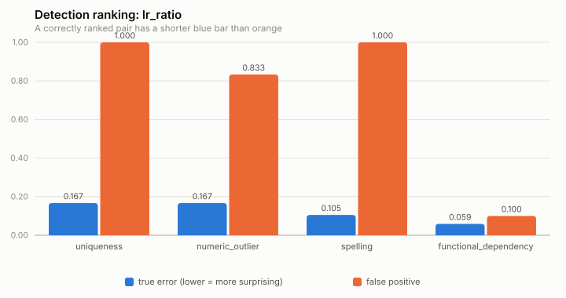

# WIKI-subset benchmark results

Human-readable view of the checked-in benchmark run. See [README.md](../README.md) for how this benchmark works and how to regenerate this file.

**Generated at:** 2026-09-25T23:20:31.561347+00:00  
**Commit:** `5d5c2f2`  
**Dataset:** wiki_subset

## Algorithm comparison

Every algorithm below scores the same 60 evaluation targets against the same ground truth (see [README.md](../README.md) for how each algorithm's per-target verdict is derived), so the comparison is apples-to-apples on effectiveness. Duration is each algorithm's own wall-clock time to go from loaded data to predictions.

| Algorithm | n | Precision | Recall | F1 | Accuracy | Duration (s) |
|---|---|---|---|---|---|---|
| `raha` | 60 | 1.000 | 0.825 | 0.904 | 0.883 | 4.59 |
| `uni_detect` | 60 | 0.838 | 0.775 | 0.805 | 0.750 | 1028.26 |





## `raha`

**Duration:** 4.59s  

| Metric | Value |
|---|---|
| Targets evaluated | 60 |
| Precision | 1.000 |
| Recall | 0.825 |
| F1 | 0.904 |
| Accuracy | 0.883 |

Column/target-level: a target is "predicted significant" if *any* of its cells was flagged -- the same granularity Uni-Detect's own output has, used for the apples-to-apples comparison above. See "Cell-level" below for Raha's native, per-cell granularity (the same one the paper's own Table 5 reports).

### By error type (target-level)

| Error type | n | Precision | Recall | F1 | Accuracy |
|---|---|---|---|---|---|
| **overall** | 60 | 1.000 | 0.825 | 0.904 | 0.883 |
| `uniqueness` | 15 | 1.000 | 0.600 | 0.750 | 0.733 |
| `numeric_outlier` | 15 | 1.000 | 1.000 | 1.000 | 1.000 |
| `spelling` | 15 | 1.000 | 1.000 | 1.000 | 1.000 |
| `functional_dependency` | 15 | 1.000 | 0.700 | 0.824 | 0.800 |



### By corruption severity (target-level)

How detection holds up as injected errors get harder to spot. `paper_example` are the paper's own canonical worked examples (a mix of true- and false-positive shapes); `obvious`/`moderate`/`subtle` are true-positive targets with graded, programmatically-injected corruption; `clean` are false-positive shapes with no injected error at all.

| Severity | n | TP | FP | FN | TN | Accuracy |
|---|---|---|---|---|---|---|
| `paper_example` | 8 | 4 | 0 | 0 | 4 | 1.000 |
| `obvious` | 12 | 11 | 0 | 1 | 0 | 0.917 |
| `moderate` | 12 | 11 | 0 | 1 | 0 | 0.917 |
| `subtle` | 12 | 7 | 0 | 5 | 0 | 0.583 |
| `clean` | 16 | 0 | 0 | 0 | 16 | 1.000 |



### By error type (cell-level)

Precision/recall/F1 over every individual `(row, column)` cell against `generate_dataset.py`'s own `injected_row_indices` ground truth -- Raha's native evaluation granularity, and typically a more informative number than the target-level reduction above for judging Raha specifically.

| Error type | n | Precision | Recall | F1 | Accuracy |
|---|---|---|---|---|---|
| **overall** | 5983 | 0.438 | 0.625 | 0.515 | 0.978 |
| `uniqueness` | 1862 | 0.176 | 0.348 | 0.234 | 0.944 |
| `numeric_outlier` | 126 | 1.000 | 1.000 | 1.000 | 1.000 |
| `spelling` | 157 | 1.000 | 1.000 | 1.000 | 1.000 |
| `functional_dependency` | 3838 | 0.694 | 0.739 | 0.716 | 0.993 |

### Evaluation targets

| Target | Error type | Severity | Expected | Predicted | Score | Result | Description |
|---|---|---|---|---|---|---|---|
| `uniqueness_fp_common_surnames` | `uniqueness` | `paper_example` | False | False | 0.000 | ✅ | Paper Figure 2(a)-style: a 'List of notable people named Smith' table with one coincidental duplicate surname among common names. |
| `uniqueness_fp_surname_pool4_00` | `uniqueness` | `clean` | False | False | 0.000 | ✅ | A 'notable people' list drawn from only 4 common surnames -- natural collisions expected, not a data error. |
| `uniqueness_fp_surname_pool6_01` | `uniqueness` | `clean` | False | False | 0.000 | ✅ | A 'notable people' list drawn from only 6 common surnames -- natural collisions expected, not a data error. |
| `uniqueness_fp_surname_pool8_02` | `uniqueness` | `clean` | False | False | 0.000 | ✅ | A 'notable people' list drawn from only 8 common surnames -- natural collisions expected, not a data error. |
| `uniqueness_fp_surname_pool10_03` | `uniqueness` | `clean` | False | False | 0.000 | ✅ | A 'notable people' list drawn from only 10 common surnames -- natural collisions expected, not a data error. |
| `uniqueness_tp_part_number_paper_example` | `uniqueness` | `paper_example` | True | True | 1.000 | ✅ | Paper Figure 6-style: a 'Part No.' column with one exact duplicate alphanumeric code -- codes like this are expected to always be unique. |
| `uniqueness_tp_subtle_00` | `uniqueness` | `subtle` | True | False | 0.000 | ❌ | An airport/ISO-code-style ID column (subtle corruption: 1 injected duplicate(s)) -- codes like this are expected to always be unique. |
| `uniqueness_tp_subtle_01` | `uniqueness` | `subtle` | True | False | 0.000 | ❌ | An airport/ISO-code-style ID column (subtle corruption: 1 injected duplicate(s)) -- codes like this are expected to always be unique. |
| `uniqueness_tp_subtle_02` | `uniqueness` | `subtle` | True | False | 0.000 | ❌ | An airport/ISO-code-style ID column (subtle corruption: 1 injected duplicate(s)) -- codes like this are expected to always be unique. |
| `uniqueness_tp_moderate_00` | `uniqueness` | `moderate` | True | False | 0.000 | ❌ | An airport/ISO-code-style ID column (moderate corruption: 4 injected duplicate(s)) -- codes like this are expected to always be unique. |
| `uniqueness_tp_moderate_01` | `uniqueness` | `moderate` | True | True | 1.000 | ✅ | An airport/ISO-code-style ID column (moderate corruption: 4 injected duplicate(s)) -- codes like this are expected to always be unique. |
| `uniqueness_tp_moderate_02` | `uniqueness` | `moderate` | True | True | 1.000 | ✅ | An airport/ISO-code-style ID column (moderate corruption: 4 injected duplicate(s)) -- codes like this are expected to always be unique. |
| `uniqueness_tp_obvious_00` | `uniqueness` | `obvious` | True | True | 1.000 | ✅ | An airport/ISO-code-style ID column (obvious corruption: 10 injected duplicate(s)) -- codes like this are expected to always be unique. |
| `uniqueness_tp_obvious_01` | `uniqueness` | `obvious` | True | True | 1.000 | ✅ | An airport/ISO-code-style ID column (obvious corruption: 10 injected duplicate(s)) -- codes like this are expected to always be unique. |
| `uniqueness_tp_obvious_02` | `uniqueness` | `obvious` | True | True | 1.000 | ✅ | An airport/ISO-code-style ID column (obvious corruption: 10 injected duplicate(s)) -- codes like this are expected to always be unique. |
| `outlier_fp_election_result` | `numeric_outlier` | `paper_example` | False | False | 0.000 | ✅ | Election vote shares: many small candidates plus one legitimately larger winner (paper's own 'C-' false-positive worked example). |
| `outlier_fp_election_margin18_00` | `numeric_outlier` | `clean` | False | False | 0.000 | ✅ | Election vote shares with a legitimate ~18% winner among many small candidates -- not a data error. |
| `outlier_fp_election_margin28_01` | `numeric_outlier` | `clean` | False | False | 0.000 | ✅ | Election vote shares with a legitimate ~28% winner among many small candidates -- not a data error. |
| `outlier_fp_election_margin38_02` | `numeric_outlier` | `clean` | False | False | 0.000 | ✅ | Election vote shares with a legitimate ~38% winner among many small candidates -- not a data error. |
| `outlier_fp_election_margin52_03` | `numeric_outlier` | `clean` | False | False | 0.000 | ✅ | Election vote shares with a legitimate ~52% winner among many small candidates -- not a data error. |
| `outlier_tp_population_typo_paper_example` | `numeric_outlier` | `paper_example` | True | True | 1.000 | ✅ | Population figures (thousands) with a decimal-point typo ('8.716' instead of '8716') -- paper's own 'C+' true-positive example. |
| `outlier_tp_subtle_00` | `numeric_outlier` | `subtle` | True | True | 1.000 | ✅ | Population figures (thousands) with a subtle decimal-point error injected into one value. |
| `outlier_tp_subtle_01` | `numeric_outlier` | `subtle` | True | True | 1.000 | ✅ | Population figures (thousands) with a subtle decimal-point error injected into one value. |
| `outlier_tp_subtle_02` | `numeric_outlier` | `subtle` | True | True | 1.000 | ✅ | Population figures (thousands) with a subtle decimal-point error injected into one value. |
| `outlier_tp_moderate_00` | `numeric_outlier` | `moderate` | True | True | 1.000 | ✅ | Population figures (thousands) with a moderate decimal-point error injected into one value. |
| `outlier_tp_moderate_01` | `numeric_outlier` | `moderate` | True | True | 1.000 | ✅ | Population figures (thousands) with a moderate decimal-point error injected into one value. |
| `outlier_tp_moderate_02` | `numeric_outlier` | `moderate` | True | True | 1.000 | ✅ | Population figures (thousands) with a moderate decimal-point error injected into one value. |
| `outlier_tp_obvious_00` | `numeric_outlier` | `obvious` | True | True | 1.000 | ✅ | Population figures (thousands) with an obvious decimal-point error injected into one value. |
| `outlier_tp_obvious_01` | `numeric_outlier` | `obvious` | True | True | 1.000 | ✅ | Population figures (thousands) with an obvious decimal-point error injected into one value. |
| `outlier_tp_obvious_02` | `numeric_outlier` | `obvious` | True | True | 1.000 | ✅ | Population figures (thousands) with an obvious decimal-point error injected into one value. |
| `spelling_fp_amendment_list` | `spelling` | `paper_example` | False | False | 0.000 | ✅ | Consecutive amendment numerals: syntactically close by design, not misspellings. |
| `spelling_fp_amendments_n6_00` | `spelling` | `clean` | False | False | 0.000 | ✅ | 6 consecutive amendment numerals -- syntactically close pairs throughout by design, not misspellings. |
| `spelling_fp_amendments_n10_01` | `spelling` | `clean` | False | False | 0.000 | ✅ | 10 consecutive amendment numerals -- syntactically close pairs throughout by design, not misspellings. |
| `spelling_fp_amendments_n14_02` | `spelling` | `clean` | False | False | 0.000 | ✅ | 14 consecutive amendment numerals -- syntactically close pairs throughout by design, not misspellings. |
| `spelling_fp_amendments_n20_03` | `spelling` | `clean` | False | False | 0.000 | ✅ | 20 consecutive amendment numerals -- syntactically close pairs throughout by design, not misspellings. |
| `spelling_tp_biography_typo_paper_example` | `spelling` | `paper_example` | True | True | 1.000 | ✅ | One genuine misspelling ('Doeling' for 'Dowling') among unrelated long biography names -- paper's own true-positive example. |
| `spelling_tp_subtle_00` | `spelling` | `subtle` | True | True | 1.000 | ✅ | One genuine misspelling ('Doeling' for 'Dowling') among long biography names, subtle corruption (diluted by one legitimate distractor pair 2 edits apart). |
| `spelling_tp_subtle_01` | `spelling` | `subtle` | True | True | 1.000 | ✅ | One genuine misspelling ('Doeling' for 'Dowling') among long biography names, subtle corruption (diluted by one legitimate distractor pair 2 edits apart). |
| `spelling_tp_subtle_02` | `spelling` | `subtle` | True | True | 1.000 | ✅ | One genuine misspelling ('Doeling' for 'Dowling') among long biography names, subtle corruption (diluted by one legitimate distractor pair 2 edits apart). |
| `spelling_tp_moderate_00` | `spelling` | `moderate` | True | True | 1.000 | ✅ | One genuine misspelling ('Doeling' for 'Dowling') among long biography names, moderate corruption (diluted by one legitimate distractor pair 4 edits apart). |
| `spelling_tp_moderate_01` | `spelling` | `moderate` | True | True | 1.000 | ✅ | One genuine misspelling ('Doeling' for 'Dowling') among long biography names, moderate corruption (diluted by one legitimate distractor pair 4 edits apart). |
| `spelling_tp_moderate_02` | `spelling` | `moderate` | True | True | 1.000 | ✅ | One genuine misspelling ('Doeling' for 'Dowling') among long biography names, moderate corruption (diluted by one legitimate distractor pair 4 edits apart). |
| `spelling_tp_obvious_00` | `spelling` | `obvious` | True | True | 1.000 | ✅ | One genuine misspelling ('Doeling' for 'Dowling') among long biography names, obvious corruption (no distractor pair). |
| `spelling_tp_obvious_01` | `spelling` | `obvious` | True | True | 1.000 | ✅ | One genuine misspelling ('Doeling' for 'Dowling') among long biography names, obvious corruption (no distractor pair). |
| `spelling_tp_obvious_02` | `spelling` | `obvious` | True | True | 1.000 | ✅ | One genuine misspelling ('Doeling' for 'Dowling') among long biography names, obvious corruption (no distractor pair). |
| `fd_fp_pageviews_vs_edits` | `functional_dependency` | `paper_example` | False | False | 0.000 | ✅ | Two independent numeric-ish columns with no real dependency. |
| `fd_fp_unrelated_domain100_00` | `functional_dependency` | `clean` | False | False | 0.000 | ✅ | Two independent columns drawn from a 0-100 integer domain -- no real dependency, not a data error. |
| `fd_fp_unrelated_domain250_01` | `functional_dependency` | `clean` | False | False | 0.000 | ✅ | Two independent columns drawn from a 0-250 integer domain -- no real dependency, not a data error. |
| `fd_fp_unrelated_domain450_02` | `functional_dependency` | `clean` | False | False | 0.000 | ✅ | Two independent columns drawn from a 0-450 integer domain -- no real dependency, not a data error. |
| `fd_fp_unrelated_domain700_03` | `functional_dependency` | `clean` | False | False | 0.000 | ✅ | Two independent columns drawn from a 0-700 integer domain -- no real dependency, not a data error. |
| `fd_tp_country_code_violation_paper_example` | `functional_dependency` | `paper_example` | True | True | 1.000 | ✅ | ISO code -> country name table (a hard functional dependency on Wikipedia) with one injected violating row. |
| `fd_tp_subtle_00` | `functional_dependency` | `subtle` | True | False | 0.000 | ❌ | ISO code -> country name table with subtle corruption (1 injected violating rows). |
| `fd_tp_subtle_01` | `functional_dependency` | `subtle` | True | False | 0.000 | ❌ | ISO code -> country name table with subtle corruption (1 injected violating rows). |
| `fd_tp_subtle_02` | `functional_dependency` | `subtle` | True | True | 1.000 | ✅ | ISO code -> country name table with subtle corruption (1 injected violating rows). |
| `fd_tp_moderate_00` | `functional_dependency` | `moderate` | True | True | 1.000 | ✅ | ISO code -> country name table with moderate corruption (4 injected violating rows). |
| `fd_tp_moderate_01` | `functional_dependency` | `moderate` | True | True | 1.000 | ✅ | ISO code -> country name table with moderate corruption (4 injected violating rows). |
| `fd_tp_moderate_02` | `functional_dependency` | `moderate` | True | True | 1.000 | ✅ | ISO code -> country name table with moderate corruption (4 injected violating rows). |
| `fd_tp_obvious_00` | `functional_dependency` | `obvious` | True | False | 0.000 | ❌ | ISO code -> country name table with obvious corruption (10 injected violating rows). |
| `fd_tp_obvious_01` | `functional_dependency` | `obvious` | True | True | 1.000 | ✅ | ISO code -> country name table with obvious corruption (10 injected violating rows). |
| `fd_tp_obvious_02` | `functional_dependency` | `obvious` | True | True | 1.000 | ✅ | ISO code -> country name table with obvious corruption (10 injected violating rows). |

## `uni_detect`

**Duration:** 1028.26s  

| Metric | Value |
|---|---|
| Targets evaluated | 60 |
| Precision | 0.838 |
| Recall | 0.775 |
| F1 | 0.805 |
| Accuracy | 0.750 |

### By error type

| Error type | n | Precision | Recall | F1 | Accuracy |
|---|---|---|---|---|---|
| **overall** | 60 | 0.838 | 0.775 | 0.805 | 0.750 |
| `uniqueness` | 15 | 1.000 | 0.700 | 0.824 | 0.800 |
| `numeric_outlier` | 15 | 0.833 | 1.000 | 0.909 | 0.867 |
| `spelling` | 15 | 1.000 | 0.700 | 0.824 | 0.800 |
| `functional_dependency` | 15 | 0.636 | 0.700 | 0.667 | 0.533 |



### By corruption severity

How detection holds up as injected errors get harder to spot. `paper_example` are the paper's own canonical worked examples (a mix of true- and false-positive shapes); `obvious`/`moderate`/`subtle` are true-positive targets with graded, programmatically-injected corruption; `clean` are false-positive shapes with no injected error at all.

| Severity | n | TP | FP | FN | TN | Accuracy |
|---|---|---|---|---|---|---|
| `paper_example` | 8 | 4 | 1 | 0 | 3 | 0.875 |
| `obvious` | 12 | 6 | 0 | 6 | 0 | 0.500 |
| `moderate` | 12 | 12 | 0 | 0 | 0 | 1.000 |
| `subtle` | 12 | 9 | 0 | 3 | 0 | 0.750 |
| `clean` | 16 | 0 | 5 | 0 | 11 | 0.688 |



### Ranking correctness

For each error type: is the true-positive (genuine error) target scored as *more surprising* (lower `lr_ratio`) than the false-positive target? This is the paper's central claim.

| Error type | TP lr_ratio | FP lr_ratio | Correctly ranked |
|---|---|---|---|
| `uniqueness` | 0.1667 | 1.0000 | ✅ |
| `numeric_outlier` | 0.1667 | 0.8333 | ✅ |
| `spelling` | 0.1000 | 1.0000 | ✅ |
| `functional_dependency` | 0.0588 | 0.1000 | ✅ |



### Evaluation targets

| Target | Error type | Severity | Expected | Predicted | lr_ratio | Result | Description |
|---|---|---|---|---|---|---|---|
| `uniqueness_fp_common_surnames` | `uniqueness` | `paper_example` | False | False | 1.0000 | ✅ | Paper Figure 2(a)-style: a 'List of notable people named Smith' table with one coincidental duplicate surname among common names. |
| `uniqueness_fp_surname_pool4_00` | `uniqueness` | `clean` | False | False | 1.0000 | ✅ | A 'notable people' list drawn from only 4 common surnames -- natural collisions expected, not a data error. |
| `uniqueness_fp_surname_pool6_01` | `uniqueness` | `clean` | False | False | 1.0000 | ✅ | A 'notable people' list drawn from only 6 common surnames -- natural collisions expected, not a data error. |
| `uniqueness_fp_surname_pool8_02` | `uniqueness` | `clean` | False | False | 1.0000 | ✅ | A 'notable people' list drawn from only 8 common surnames -- natural collisions expected, not a data error. |
| `uniqueness_fp_surname_pool10_03` | `uniqueness` | `clean` | False | False | 1.0000 | ✅ | A 'notable people' list drawn from only 10 common surnames -- natural collisions expected, not a data error. |
| `uniqueness_tp_part_number_paper_example` | `uniqueness` | `paper_example` | True | True | 0.1667 | ✅ | Paper Figure 6-style: a 'Part No.' column with one exact duplicate alphanumeric code -- codes like this are expected to always be unique. |
| `uniqueness_tp_subtle_00` | `uniqueness` | `subtle` | True | True | 0.0833 | ✅ | An airport/ISO-code-style ID column (subtle corruption: 1 injected duplicate(s)) -- codes like this are expected to always be unique. |
| `uniqueness_tp_subtle_01` | `uniqueness` | `subtle` | True | True | 0.0833 | ✅ | An airport/ISO-code-style ID column (subtle corruption: 1 injected duplicate(s)) -- codes like this are expected to always be unique. |
| `uniqueness_tp_subtle_02` | `uniqueness` | `subtle` | True | True | 0.0833 | ✅ | An airport/ISO-code-style ID column (subtle corruption: 1 injected duplicate(s)) -- codes like this are expected to always be unique. |
| `uniqueness_tp_moderate_00` | `uniqueness` | `moderate` | True | True | 0.0833 | ✅ | An airport/ISO-code-style ID column (moderate corruption: 4 injected duplicate(s)) -- codes like this are expected to always be unique. |
| `uniqueness_tp_moderate_01` | `uniqueness` | `moderate` | True | True | 0.0833 | ✅ | An airport/ISO-code-style ID column (moderate corruption: 4 injected duplicate(s)) -- codes like this are expected to always be unique. |
| `uniqueness_tp_moderate_02` | `uniqueness` | `moderate` | True | True | 0.0833 | ✅ | An airport/ISO-code-style ID column (moderate corruption: 4 injected duplicate(s)) -- codes like this are expected to always be unique. |
| `uniqueness_tp_obvious_00` | `uniqueness` | `obvious` | True | False | 1.0000 | ❌ | An airport/ISO-code-style ID column (obvious corruption: 10 injected duplicate(s)) -- codes like this are expected to always be unique. |
| `uniqueness_tp_obvious_01` | `uniqueness` | `obvious` | True | False | 1.0000 | ❌ | An airport/ISO-code-style ID column (obvious corruption: 10 injected duplicate(s)) -- codes like this are expected to always be unique. |
| `uniqueness_tp_obvious_02` | `uniqueness` | `obvious` | True | False | 1.0000 | ❌ | An airport/ISO-code-style ID column (obvious corruption: 10 injected duplicate(s)) -- codes like this are expected to always be unique. |
| `outlier_fp_election_result` | `numeric_outlier` | `paper_example` | False | False | 0.8333 | ✅ | Election vote shares: many small candidates plus one legitimately larger winner (paper's own 'C-' false-positive worked example). |
| `outlier_fp_election_margin18_00` | `numeric_outlier` | `clean` | False | False | 0.2500 | ✅ | Election vote shares with a legitimate ~18% winner among many small candidates -- not a data error. |
| `outlier_fp_election_margin28_01` | `numeric_outlier` | `clean` | False | False | 0.2500 | ✅ | Election vote shares with a legitimate ~28% winner among many small candidates -- not a data error. |
| `outlier_fp_election_margin38_02` | `numeric_outlier` | `clean` | False | True | 0.0526 | ❌ | Election vote shares with a legitimate ~38% winner among many small candidates -- not a data error. |
| `outlier_fp_election_margin52_03` | `numeric_outlier` | `clean` | False | True | 0.0667 | ❌ | Election vote shares with a legitimate ~52% winner among many small candidates -- not a data error. |
| `outlier_tp_population_typo_paper_example` | `numeric_outlier` | `paper_example` | True | True | 0.1667 | ✅ | Population figures (thousands) with a decimal-point typo ('8.716' instead of '8716') -- paper's own 'C+' true-positive example. |
| `outlier_tp_subtle_00` | `numeric_outlier` | `subtle` | True | True | 0.0714 | ✅ | Population figures (thousands) with a subtle decimal-point error injected into one value. |
| `outlier_tp_subtle_01` | `numeric_outlier` | `subtle` | True | True | 0.1111 | ✅ | Population figures (thousands) with a subtle decimal-point error injected into one value. |
| `outlier_tp_subtle_02` | `numeric_outlier` | `subtle` | True | True | 0.1000 | ✅ | Population figures (thousands) with a subtle decimal-point error injected into one value. |
| `outlier_tp_moderate_00` | `numeric_outlier` | `moderate` | True | True | 0.0625 | ✅ | Population figures (thousands) with a moderate decimal-point error injected into one value. |
| `outlier_tp_moderate_01` | `numeric_outlier` | `moderate` | True | True | 0.1429 | ✅ | Population figures (thousands) with a moderate decimal-point error injected into one value. |
| `outlier_tp_moderate_02` | `numeric_outlier` | `moderate` | True | True | 0.0588 | ✅ | Population figures (thousands) with a moderate decimal-point error injected into one value. |
| `outlier_tp_obvious_00` | `numeric_outlier` | `obvious` | True | True | 0.0714 | ✅ | Population figures (thousands) with an obvious decimal-point error injected into one value. |
| `outlier_tp_obvious_01` | `numeric_outlier` | `obvious` | True | True | 0.0714 | ✅ | Population figures (thousands) with an obvious decimal-point error injected into one value. |
| `outlier_tp_obvious_02` | `numeric_outlier` | `obvious` | True | True | 0.1000 | ✅ | Population figures (thousands) with an obvious decimal-point error injected into one value. |
| `spelling_fp_amendment_list` | `spelling` | `paper_example` | False | False | 1.0000 | ✅ | Consecutive amendment numerals: syntactically close by design, not misspellings. |
| `spelling_fp_amendments_n6_00` | `spelling` | `clean` | False | False | 1.0000 | ✅ | 6 consecutive amendment numerals -- syntactically close pairs throughout by design, not misspellings. |
| `spelling_fp_amendments_n10_01` | `spelling` | `clean` | False | False | 1.0000 | ✅ | 10 consecutive amendment numerals -- syntactically close pairs throughout by design, not misspellings. |
| `spelling_fp_amendments_n14_02` | `spelling` | `clean` | False | False | 1.0000 | ✅ | 14 consecutive amendment numerals -- syntactically close pairs throughout by design, not misspellings. |
| `spelling_fp_amendments_n20_03` | `spelling` | `clean` | False | False | 1.0000 | ✅ | 20 consecutive amendment numerals -- syntactically close pairs throughout by design, not misspellings. |
| `spelling_tp_biography_typo_paper_example` | `spelling` | `paper_example` | True | True | 0.1000 | ✅ | One genuine misspelling ('Doeling' for 'Dowling') among unrelated long biography names -- paper's own true-positive example. |
| `spelling_tp_subtle_00` | `spelling` | `subtle` | True | False | 0.5000 | ❌ | One genuine misspelling ('Doeling' for 'Dowling') among long biography names, subtle corruption (diluted by one legitimate distractor pair 2 edits apart). |
| `spelling_tp_subtle_01` | `spelling` | `subtle` | True | False | 0.5000 | ❌ | One genuine misspelling ('Doeling' for 'Dowling') among long biography names, subtle corruption (diluted by one legitimate distractor pair 2 edits apart). |
| `spelling_tp_subtle_02` | `spelling` | `subtle` | True | False | 0.5000 | ❌ | One genuine misspelling ('Doeling' for 'Dowling') among long biography names, subtle corruption (diluted by one legitimate distractor pair 2 edits apart). |
| `spelling_tp_moderate_00` | `spelling` | `moderate` | True | True | 0.1538 | ✅ | One genuine misspelling ('Doeling' for 'Dowling') among long biography names, moderate corruption (diluted by one legitimate distractor pair 4 edits apart). |
| `spelling_tp_moderate_01` | `spelling` | `moderate` | True | True | 0.1538 | ✅ | One genuine misspelling ('Doeling' for 'Dowling') among long biography names, moderate corruption (diluted by one legitimate distractor pair 4 edits apart). |
| `spelling_tp_moderate_02` | `spelling` | `moderate` | True | True | 0.1538 | ✅ | One genuine misspelling ('Doeling' for 'Dowling') among long biography names, moderate corruption (diluted by one legitimate distractor pair 4 edits apart). |
| `spelling_tp_obvious_00` | `spelling` | `obvious` | True | True | 0.0800 | ✅ | One genuine misspelling ('Doeling' for 'Dowling') among long biography names, obvious corruption (no distractor pair). |
| `spelling_tp_obvious_01` | `spelling` | `obvious` | True | True | 0.0800 | ✅ | One genuine misspelling ('Doeling' for 'Dowling') among long biography names, obvious corruption (no distractor pair). |
| `spelling_tp_obvious_02` | `spelling` | `obvious` | True | True | 0.0800 | ✅ | One genuine misspelling ('Doeling' for 'Dowling') among long biography names, obvious corruption (no distractor pair). |
| `fd_fp_pageviews_vs_edits` | `functional_dependency` | `paper_example` | False | True | 0.1000 | ❌ | Two independent numeric-ish columns with no real dependency. |
| `fd_fp_unrelated_domain100_00` | `functional_dependency` | `clean` | False | False | 0.2500 | ✅ | Two independent columns drawn from a 0-100 integer domain -- no real dependency, not a data error. |
| `fd_fp_unrelated_domain250_01` | `functional_dependency` | `clean` | False | True | 0.0625 | ❌ | Two independent columns drawn from a 0-250 integer domain -- no real dependency, not a data error. |
| `fd_fp_unrelated_domain450_02` | `functional_dependency` | `clean` | False | True | 0.0556 | ❌ | Two independent columns drawn from a 0-450 integer domain -- no real dependency, not a data error. |
| `fd_fp_unrelated_domain700_03` | `functional_dependency` | `clean` | False | True | 0.0556 | ❌ | Two independent columns drawn from a 0-700 integer domain -- no real dependency, not a data error. |
| `fd_tp_country_code_violation_paper_example` | `functional_dependency` | `paper_example` | True | True | 0.0588 | ✅ | ISO code -> country name table (a hard functional dependency on Wikipedia) with one injected violating row. |
| `fd_tp_subtle_00` | `functional_dependency` | `subtle` | True | True | 0.0588 | ✅ | ISO code -> country name table with subtle corruption (1 injected violating rows). |
| `fd_tp_subtle_01` | `functional_dependency` | `subtle` | True | True | 0.0588 | ✅ | ISO code -> country name table with subtle corruption (1 injected violating rows). |
| `fd_tp_subtle_02` | `functional_dependency` | `subtle` | True | True | 0.0588 | ✅ | ISO code -> country name table with subtle corruption (1 injected violating rows). |
| `fd_tp_moderate_00` | `functional_dependency` | `moderate` | True | True | 0.0588 | ✅ | ISO code -> country name table with moderate corruption (4 injected violating rows). |
| `fd_tp_moderate_01` | `functional_dependency` | `moderate` | True | True | 0.0588 | ✅ | ISO code -> country name table with moderate corruption (4 injected violating rows). |
| `fd_tp_moderate_02` | `functional_dependency` | `moderate` | True | True | 0.0588 | ✅ | ISO code -> country name table with moderate corruption (4 injected violating rows). |
| `fd_tp_obvious_00` | `functional_dependency` | `obvious` | True | False | 1.0000 | ❌ | ISO code -> country name table with obvious corruption (10 injected violating rows). |
| `fd_tp_obvious_01` | `functional_dependency` | `obvious` | True | False | 1.0000 | ❌ | ISO code -> country name table with obvious corruption (10 injected violating rows). |
| `fd_tp_obvious_02` | `functional_dependency` | `obvious` | True | False | 1.0000 | ❌ | ISO code -> country name table with obvious corruption (10 injected violating rows). |

---

_Regenerate this file (and the charts above) from a results JSON with:_

```bash
uv run python benchmarks/wiki_subset/generate_report.py
```

