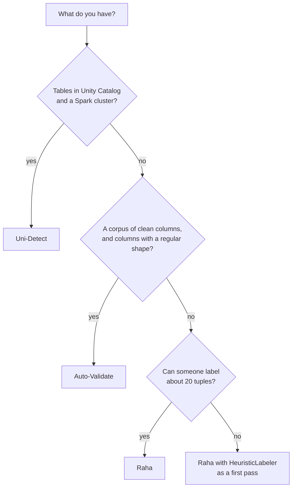

# Choosing an algorithm

Start from what you have, not from what sounds best.

## At a glance

| | Raha | Auto-Validate | Uni-Detect |
|---|---|---|---|
| Human effort | Label about 20 tuples | None | None |
| Needs a corpus | No | Clean columns, in memory | Tables in Unity Catalog |
| Finds | Anything its strategies and your labels teach it | Values that break a column's learned format | Duplicates, FD violations, numeric outliers, typos |
| Strong when | The errors are specific to your data | Columns are IDs, dates, codes, emails | You have many governed tables and want ranked, explainable findings |
| Weak when | Nobody can label | Free text; tiny corpora | The corpus is small or unlike your target |
| Runtime | pandas + scikit-learn | pandas | Spark + Delta |
| Scale | One table in memory | One table in memory | Distributed |

## Rules of thumb

- **Raha is the best general-purpose starting point for one table** when you can spare a few
  minutes of labeling. On the repository's [benchmark](../benchmarks.md) it had the best
  precision and F1 and ran in seconds.
- **Auto-Validate is high precision but conservative.** It flags only what clearly breaks a
  learned pattern, so expect it to miss subtle errors. It shines for format drift in pipelines.
- **Uni-Detect is the one to automate** across a data platform. It needs setup (a corpus and
  Spark) but then scans any table without further input and says how surprising each finding is.
- **They are complementary.** [Run several and compare](comparing-algorithms.md); agreement is
  strong evidence.

!!! note
    Benchmark figures describe a small synthetic-plus-real dataset. Treat them as a guide to
    relative behavior, not a promise about your data. Always spot-check flagged cells.
